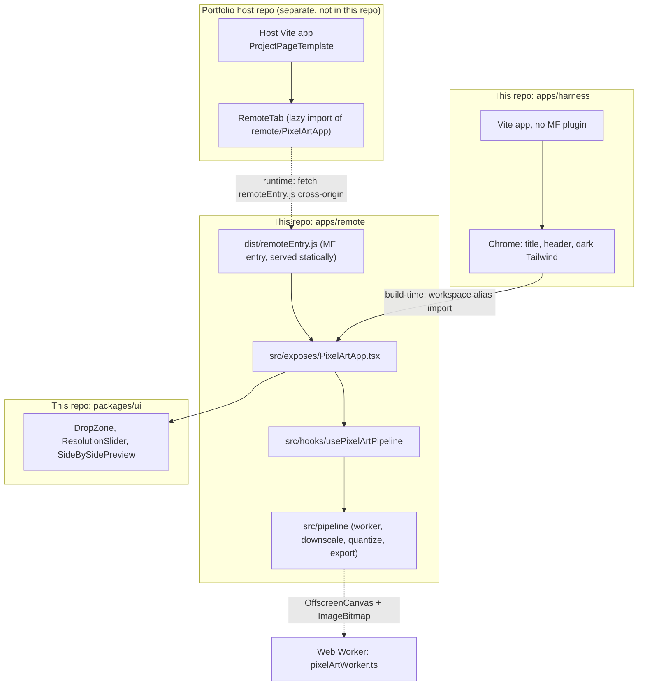

# feat: Pixel-Art Microfrontend v1

## Summary

Stand up a pnpm-monorepo Vite project where `apps/remote` ships a single default-exported `PixelArtApp` React component as a `@module-federation/vite` remote, `apps/harness` hosts the same component as a standalone Vite app via workspace alias, and `packages/ui` carries the small primitive set the component reuses. Image conversion runs in a Web Worker (OffscreenCanvas + ImageBitmap) using area-average downscale plus `image-q`'s Wu quantizer — both pure-static deploy targets are then ready to wire to the user's host portfolio and a standalone URL.

---

## Problem Frame

Origin establishes the problem (a portfolio piece + standalone tool, MF integration, client-only conversion, weekend-shippable v1). See `docs/brainstorms/2026-05-06-pixel-art-microfrontend-requirements.md`. The plan-time pain this doc solves is producing a concrete, dependency-ordered execution path that doesn't get tripped by the known sharp edges of MF in Vite — the remote can't run `vite dev`, base-path hosting has open issues, and naïve nearest-neighbor downscaling of photos doesn't actually look like pixel art.

---

## Requirements

Carried verbatim from origin (`docs/brainstorms/2026-05-06-pixel-art-microfrontend-requirements.md`); R-IDs preserved.

**Core conversion experience**
- R1. Drag-and-drop image input with click-to-pick fallback.
- R2. Live resolution slider over 16 / 32 / 64 / 128 / 256 px on the long edge — no separate apply step.
- R3. In-browser conversion: downscale + auto color quantization from the source image. **Plan-time deviation:** area-average downscale instead of strict nearest-neighbor (see Key Technical Decisions). User-facing result fidelity is the contract; the resampling kernel is the implementation choice.
- R4. Source and result rendered side-by-side; result is crisp at any display size.
- R5. Aspect ratio of the source is preserved.
- R6. Single-action PNG export at native pixel resolution.

**Dual-deploy surface**
- R7. Single default-exported React component as the expose surface; no top-level routing inside the remote.
- R8. Same component renders correctly in the portfolio's `RemoteTab` slot **and** in the standalone harness — no consumer-specific branches.
- R9. Standalone shell (the harness) provides minimum chrome only: title, header, dark/neutral Tailwind aesthetic.
- R10. Both deploys are pure static hosting — no backend.

**Behavior under host integration**
- R11. React + react-dom are MF shared singletons; the remote does not double-ship them.
- R12. The remote tolerates unmount/remount cycles without leaking timers, object URLs, ImageBitmaps, canvas refs, or in-flight worker jobs.

**Origin actors:** A1 (portfolio visitor), A2 (standalone visitor) — both honored without any consumer-specific branching, satisfying R8.
**Origin flows:** F1 (convert via portfolio embed), F2 (convert via standalone deploy) — both share the same component path; only the surrounding chrome differs.
**Origin acceptance examples:** AE1 (slider drag perf, source pane stable), AE2 (PNG export native dimensions), AE3 (standalone cold-load works), AE4 (no leaks across mount/unmount cycles).

---

## Scope Boundaries

Carried from origin (`Scope Boundaries` in the requirements doc):

- Aspect-ratio override, curated palettes, brand-color locking, saturation, dithering — all deferred past v1.
- Server-backed or hybrid conversion — explicitly rejected.
- Shareable result URLs / persistent gallery / conversion history — out of scope.
- Multi-image batch — out of v1.
- Animated transitions between resolutions — out of v1.
- Auth, accounts, analytics — none in v1.
- SEO beyond title/description on the standalone — out of v1.
- Mobile-optimized layouts beyond "doesn't break on phones" — desktop-primary.

### Deferred to Follow-Up Work

- TypeScript module declaration for `remote/PixelArtApp` — lives in the portfolio host repo, not in this repo. `docs/deploy.md` (U8) carries the snippet text.
- Specific deploy host pick (Vercel / Netlify / Cloudflare Pages) — plan covers required headers and a smoke test; user picks at deploy time.
- E2E test framework (Playwright/Cypress) — Vitest + jsdom integration tests are sufficient for v1.
- WASM-backed quantization upgrade — `image-q` Wu is fast enough for v1; revisit only if profiling shows a real bottleneck.

---

## Context & Research

### Relevant Code and Patterns

- `apps/harness/`, `apps/remote/src/exposes/`, `apps/remote/src/layouts/`, `apps/remote/src/pages/`, `packages/ui/` — empty scaffolding that already encodes the intended layout. Use it.
- The portfolio host's pattern (supplied during brainstorm): `RemoteTab` lazy-imports a federated module, wraps in `Suspense` + crash boundary, and gives the remote a flat content slot with no top-level routing. The remote conforms to that contract — it does not introduce its own error boundary or routes.
- Tailwind dark/neutral aesthetic from the host's `ProjectPageTemplate` (e.g., `bg-neutral-800`, `text-neutral-400`, `max-w-6xl mx-auto`). The standalone harness mirrors this.

### Institutional Learnings

- None yet (`docs/solutions/` does not exist in this repo).

### External References

- [`@module-federation/vite` plugin](https://www.npmjs.com/package/@module-federation/vite) — official MF Vite plugin (v1.15.x as of early 2026). Used by both host and remote.
- [Module Federation Vite guide](https://module-federation.io/guide/build-plugins/plugins-vite) and [Shared config reference](https://module-federation.io/configure/shared) — host/remote config shape, shared-deps semantics.
- [`image-q`](https://www.npmjs.com/package/image-q) — TS, ESM, MIT; carries Wu, RGBQuant, NeuQuant. Used for color quantization.
- [MDN: OffscreenCanvas](https://developer.mozilla.org/en-US/docs/Web/API/OffscreenCanvas), [`createImageBitmap`](https://developer.mozilla.org/en-US/docs/Web/API/Window/createImageBitmap), [`Crisp pixel-art look`](https://developer.mozilla.org/en-US/docs/Games/Techniques/Crisp_pixel_art_look) — standard browser primitives.
- [Web Performance Calendar 2025: Non-blocking image canvas](https://calendar.perfplanet.com/2025/non-blocking-image-canvas/) — current 2025/2026 pattern for transferred ImageBitmap + OffscreenCanvas in workers.
- [Soledad Penadés: Sharp canvases (2024)](https://soledadpenades.com/posts/2024/sharp-canvases/) — devicePixelRatio + `image-rendering` gotchas.
- [MF Vite issue #183](https://github.com/module-federation/vite/issues/183), [#159](https://github.com/module-federation/vite/issues/159), [#217](https://github.com/module-federation/vite/issues/217) — known dev-mode and base-path sharp edges.

---

## Key Technical Decisions

- **Toolchain: Vite + `@module-federation/vite` (v1.x).** Matches the portfolio host's bundler, so MF runtime semantics agree end-to-end. Pin the same major in both repos to avoid silent runtime drift.
- **Single default-exported component.** Matches the host's `RemoteTab` contract (`() => Promise<{ default: ComponentType }>`). Avoids inventing a multi-export plugin protocol that v1 doesn't need.
- **`apps/harness` imports the exposed component via workspace alias, not federation.** The MF plugin in the harness is *off*. The harness is just a normal Vite app that bundles the source directly. This sidesteps dual-runtime trouble entirely. Alias resolves `@pixelart/remote/exposes/PixelArtApp` to `apps/remote/src/exposes/PixelArtApp.tsx`.
- **React/react-dom shared as `singleton: true, strictVersion: true`.** Strict-version errors loudly on mismatch; without it, two React copies silently break hooks. Not `eager` — keeps `remoteEntry.js` small.
- **Remote dev workflow uses `vite build --watch` + the harness, not `vite dev` on the remote.** `@module-federation/vite` does not currently support `vite dev` for remotes (issues #183, #20). The harness gives us a normal `vite dev` loop because it doesn't go through MF.
- **Area-average downscale, not strict nearest-neighbor.** True nearest-neighbor of a photographic source aliases harshly — the result reads as noise, not pixel art. The "pixel-art" aesthetic comes from low resolution + limited palette, not the resampling kernel. Browser's built-in `imageSmoothingEnabled = true, imageSmoothingQuality = 'high'` gives area-averaging at downscale time. This is the documented deviation from origin R3 wording, confirmed in synthesis.
- **`image-q` (Wu quantizer), default 16-color palette.** Wu is fast and near-optimal; 16 colors gives a recognizable "limited palette" look without painful loss on most photos. Quantize *after* downscale so the input is at most 256×256 — keeps quantization in the millisecond range.
- **Pipeline runs in a Web Worker with OffscreenCanvas + transferred ImageBitmap.** Decoding via `createImageBitmap(file)` on the main thread, transferring to the worker. Main-thread-only janks slider drag at 4000×3000 sources.
- **`image-rendering: pixelated` on the result canvas.** Standard pattern. If Safari's known canvas edge case bites in practice (caniuse #2052), fall back to render-at-native + CSS `transform: scale()` with `transform-origin: 0 0`. Plan keeps this as a fallback, not the default.
- **PNG export via `convertToBlob({ type: 'image/png' })` at native pixel size.** No upscaling injected by browser smoothing because we never `drawImage` to a larger canvas. Anchor + revoke `objectURL` after click.
- **pnpm workspaces** as the monorepo manager. Install scripts live at root; per-package scripts run via `pnpm --filter`.
- **Vitest** for unit and component tests; `jsdom` environment for DOM tests, plus a small worker mock for hook-level tests (the worker pipeline tests can run in browser-mode Vitest if convenient).

---

## Open Questions

### Resolved During Planning

- **Bundler choice**: Vite + `@module-federation/vite` (matches host).
- **Shared-deps strategy**: React + react-dom as `singleton: true, strictVersion: true`, no `eager`.
- **Quantization library**: `image-q` (Wu).
- **Downscale strategy**: area-average, not strict nearest-neighbor.
- **Worker vs main-thread**: Web Worker + OffscreenCanvas.
- **Dual-deploy split**: harness imports source directly via workspace alias; only the host goes through federation.
- **Component prop surface**: zero — the exposed component is fully self-contained for v1 (origin Deferred-to-Planning question resolved as "self-contained").

### Deferred to Implementation

- **Exact `base` path for the remote** — depends on the user's chosen deploy host's URL. `vite.config.ts` will start with `base: '/'` and U8 documents the smoke test for subpath hosting.
- **Slider exact UI primitive choice** — bare `<input type="range">` styled with Tailwind vs. a small custom slider. Either works; pick during U5 based on what reads cleanest with the side-by-side layout.
- **Whether to use `requestAnimationFrame` debounce vs. fixed 16ms** — both viable; pick during U3 based on slider feel.
- **Drop-zone hover state visual treatment** — choose during U5; Tailwind state classes only.

---

## Output Structure

This plan creates a greenfield monorepo on top of the existing empty scaffolding. Expected layout after U1–U8 land:

```
.
├── apps/
│   ├── harness/
│   │   ├── src/
│   │   │   ├── App.tsx
│   │   │   ├── main.tsx
│   │   │   └── styles.css
│   │   ├── tests/
│   │   │   └── integration/
│   │   │       └── render.test.tsx
│   │   ├── index.html
│   │   ├── package.json
│   │   ├── tsconfig.json
│   │   └── vite.config.ts
│   └── remote/
│       ├── src/
│       │   ├── exposes/
│       │   │   └── PixelArtApp.tsx
│       │   ├── pipeline/
│       │   │   ├── pixelArtWorker.ts
│       │   │   ├── protocol.ts
│       │   │   ├── downscale.ts
│       │   │   ├── quantize.ts
│       │   │   └── exportPng.ts
│       │   └── hooks/
│       │       └── usePixelArtPipeline.ts
│       ├── tests/
│       │   ├── exposes/
│       │   │   └── PixelArtApp.test.tsx
│       │   ├── pipeline/
│       │   │   ├── protocol.test.ts
│       │   │   ├── usePixelArtPipeline.test.ts
│       │   │   ├── downscale.test.ts
│       │   │   ├── quantize.test.ts
│       │   │   └── exportPng.test.ts
│       │   └── lifecycle/
│       │       └── unmount-remount.test.tsx
│       ├── index.html
│       ├── package.json
│       ├── tsconfig.json
│       └── vite.config.ts
├── packages/
│   └── ui/
│       ├── src/
│       │   ├── DropZone.tsx
│       │   ├── ResolutionSlider.tsx
│       │   ├── SideBySidePreview.tsx
│       │   └── index.ts
│       ├── tests/
│       │   ├── DropZone.test.tsx
│       │   └── ResolutionSlider.test.tsx
│       ├── package.json
│       └── tsconfig.json
├── docs/
│   ├── brainstorms/
│   │   └── 2026-05-06-pixel-art-microfrontend-requirements.md   (existing)
│   ├── plans/
│   │   └── 2026-05-06-001-feat-pixel-art-microfrontend-v1-plan.md   (this doc)
│   └── deploy.md
├── eslint.config.js
├── package.json
├── pnpm-workspace.yaml
├── postcss.config.js
├── tailwind.config.ts
├── tsconfig.base.json
└── vitest.config.ts
```

The implementer may adjust if a better layout emerges; per-unit `**Files:**` sections remain authoritative.

---

## High-Level Technical Design

> *This illustrates the intended approach and is directional guidance for review, not implementation specification. The implementing agent should treat it as context, not code to reproduce.*

**Two consumers, one source file** — the federated remote and the standalone harness both render the same `PixelArtApp.tsx`, but reach it via different paths.



**Conversion sequence** — what happens from drop to result, on both initial drop and slider drag.

```mermaid
sequenceDiagram
  participant U as Visitor
  participant App as PixelArtApp
  participant H as usePixelArtPipeline
  participant W as Worker (OffscreenCanvas)
  participant C as Result canvas

  U->>App: drop image file
  App->>App: createImageBitmap(file) → sourceBitmap
  App->>H: process(sourceBitmap, sliderValue)
  H->>W: postMessage({jobId, bitmap, targetLongEdge}, [bitmap])
  W->>W: area-average downscale
  W->>W: image-q Wu quantize (16 colors)
  W-->>H: postMessage({jobId, pixelBuffer, w, h})
  H-->>App: result buffer
  App->>C: render at native size; CSS image-rendering: pixelated

  U->>App: drag slider to new value
  App->>H: process(sourceBitmap, newValue)
  Note over H: debounce 16ms; abort previous in-flight job
  H->>W: postMessage({jobId: N+1, ...})
  W-->>H: result for jobId N+1 only
  H-->>App: result buffer
  App->>C: re-render
```

---

## Implementation Units

### U1. Monorepo scaffold + remote skeleton with MF

**Goal:** Establish the pnpm monorepo, base TypeScript / Tailwind / lint config, and `apps/remote` with `@module-federation/vite` configured. End state: `pnpm --filter @pixelart/remote build` emits a working `dist/remoteEntry.js` for a placeholder `PixelArtApp` component, and the bundle does not contain React.

**Requirements:** R7, R10, R11

**Dependencies:** None

**Files:**
- Create: `package.json` (root, with workspace scripts), `pnpm-workspace.yaml`, `tsconfig.base.json`, `tailwind.config.ts`, `postcss.config.js`, `eslint.config.js`, `.prettierrc`, `vitest.config.ts`
- Create: `apps/remote/package.json`, `apps/remote/vite.config.ts`, `apps/remote/tsconfig.json`, `apps/remote/index.html`, `apps/remote/src/exposes/PixelArtApp.tsx` (placeholder — renders a dark-themed labeled div), `apps/remote/src/styles.css` (Tailwind directives entry)
- Test: `apps/remote/tests/build/remote-entry.test.ts` (runs `vite build`, asserts `dist/remoteEntry.js` exists, asserts no React identifiers leak into remote chunks)

**Approach:**
- pnpm workspace covering `apps/*` and `packages/*`. Root `package.json` provides composite scripts: `pnpm build`, `pnpm dev:harness`, `pnpm dev:remote` (which is `vite build --watch` per the MF Vite limitation), `pnpm typecheck`, `pnpm lint`, `pnpm test`.
- Tailwind configured at the root with content globs covering all `apps/*/src/**/*.{ts,tsx}` and `packages/*/src/**/*.{ts,tsx}`. Each app imports its own CSS entry that pulls Tailwind directives.
- `@module-federation/vite` configured on `apps/remote` as a remote: `name: 'pixelart_remote'`, `filename: 'remoteEntry.js'`, `exposes: { './PixelArtApp': './src/exposes/PixelArtApp.tsx' }`, `shared: { react: { singleton: true, strictVersion: true }, 'react-dom': { singleton: true, strictVersion: true } }`.
- Vite dev/preview headers set `Access-Control-Allow-Origin: *` for both `server.headers` and `preview.headers`.
- Placeholder `PixelArtApp.tsx` renders a centered card with title "Picture to Pixel Art" — enough to confirm federation pipeline through to render.

**Patterns to follow:** None local (greenfield). Match the host's calculators-page Tailwind classes (dark neutral palette) for the placeholder card.

**Test scenarios:**
- *Happy path*: `pnpm --filter @pixelart/remote build` exits 0 and produces `dist/remoteEntry.js` plus a `PixelArtApp` chunk.
- *Integration*: `vite preview` against the remote serves `remoteEntry.js` with `Access-Control-Allow-Origin: *`.
- *Edge case*: bundle audit (test reads built chunks) confirms `react` and `react-dom` are NOT bundled into remote chunks (they appear only as MF shared-dep references).
- *Error path*: build fails fast with a clear message if `exposes` is misconfigured (sanity check on the federation plugin wiring).

**Verification:**
- Root `pnpm build` succeeds.
- The placeholder remote renders correctly under `vite preview` at `apps/remote`'s local URL.
- Bundle inspection confirms shared-deps exclusion of React.

---

### U2. Standalone harness (`apps/harness`) with dark Tailwind chrome

**Goal:** Build the standalone shell — a Vite app that imports `PixelArtApp` directly via workspace alias and provides minimum chrome (title, header, dark/neutral Tailwind, optional footer link to portfolio).

**Requirements:** R8, R9, R10

**Dependencies:** U1

**Files:**
- Create: `apps/harness/package.json`, `apps/harness/vite.config.ts`, `apps/harness/tsconfig.json`, `apps/harness/index.html`, `apps/harness/src/main.tsx`, `apps/harness/src/App.tsx`, `apps/harness/src/styles.css`
- Test: `apps/harness/tests/integration/render.test.tsx`

**Approach:**
- Standard Vite + React + TS app. **No `federation()` plugin call** — the harness is a normal app.
- TS path alias `@pixelart/remote/exposes/*` → `../remote/src/exposes/*` (configured in `tsconfig.json` and matched in `vite.config.ts` via `resolve.alias`).
- `App.tsx` provides the chrome: header with project title, content area centered with `max-w-6xl mx-auto`, dark background (Tailwind `bg-neutral-950` or `bg-neutral-900`), and mounts `<PixelArtApp />`.
- HTML head sets `<title>Picture to Pixel Art</title>` and a basic description meta.

**Patterns to follow:** The host's `ProjectPageTemplate` aesthetic from the supplied calculators-page snippet (`max-w-6xl mx-auto`, `border-neutral-700`, `text-neutral-400`).

**Test scenarios:**
- *Happy path*: harness mounts and renders `PixelArtApp` with no console errors or React warnings.
- *Happy path*: `pnpm --filter @pixelart/harness build` produces a static `dist/` whose initial HTML loads the placeholder app under `vite preview`.
- *Edge case*: `pnpm --filter @pixelart/harness dev` opens a working page (no MF dev-mode caveats since the harness isn't federated).
- *Integration*: a smoke test that imports the workspace-aliased `PixelArtApp` and asserts its rendered DOM contains the expected title text — confirms the alias resolves at test time.
- *Covers AE3*: harness mounts `PixelArtApp` cleanly without any portfolio `ProjectPageTemplate` wrapper and without console errors about missing host context (asserts on a `console.error` spy across the mount lifecycle). The deployed-URL half of AE3 is verified by U8's smoke test.

**Verification:**
- `pnpm --filter @pixelart/harness dev` opens a working page.
- `pnpm --filter @pixelart/harness build` emits a static `dist/` that runs cleanly under `vite preview`.

---

### U3. Worker pipeline skeleton (protocol + hook, no real conversion yet)

**Goal:** Wire the Web Worker, OffscreenCanvas message protocol, and the `usePixelArtPipeline` hook with debouncing and abort. End state: a real worker handles `process` / `abort` / `error` messages and round-trips an ImageBitmap-shaped payload, but the "processing" is a no-op identity render.

**Requirements:** R3, R12 (lays the groundwork)

**Dependencies:** U1

**Files:**
- Create: `apps/remote/src/pipeline/pixelArtWorker.ts`, `apps/remote/src/pipeline/protocol.ts`, `apps/remote/src/hooks/usePixelArtPipeline.ts`
- Test: `apps/remote/tests/pipeline/protocol.test.ts`, `apps/remote/tests/pipeline/usePixelArtPipeline.test.ts`

**Approach:**
- Define message shapes in `protocol.ts`: `ProcessRequest { type: 'process', jobId, bitmap, targetLongEdge }`, `ProcessResult { type: 'result', jobId, pixelBuffer, width, height }`, `AbortRequest { type: 'abort', jobId }`, `WorkerError { type: 'error', jobId, code, message }`.
- Worker keeps a `currentJobId` and yields cooperatively at `await`-able boundaries; if `currentJobId` no longer matches, abandons.
- For this unit, the worker's "processing" is identity: render the source `ImageBitmap` to an OffscreenCanvas at the target long-edge dimension using browser-default resampling, return a `Uint8ClampedArray` of pixels via transferable buffer.
- `usePixelArtPipeline` hook owns the worker reference (`new Worker(new URL('../pipeline/pixelArtWorker.ts', import.meta.url), { type: 'module' })`), exposes `process(bitmap, targetRes)`, debounces ~16ms, increments `jobId` on each call, and posts an `abort` for the previous in-flight job before sending the new one.

**Patterns to follow:** Web Performance Calendar 2025 article's transferable-ImageBitmap pattern; standard `useEffect` cleanup for worker lifecycle.

**Test scenarios:**
- *Happy path*: posting one `process` message returns a `result` with the expected dimensions (long edge = target, short edge = proportional).
- *Happy path*: hook integration — calling `process` once dispatches one worker message and resolves with the result.
- *Edge case*: posting two `process` calls back-to-back; only the latter's result is delivered to the caller (the first is aborted).
- *Edge case*: `targetLongEdge=0` is rejected at the hook boundary before any worker message is sent.
- *Edge case*: hook debouncing — 10 rapid calls within 16ms collapse to ~1 worker dispatch.
- *Error path*: malformed message yields a `WorkerError` with a descriptive code.
- *Integration*: hook unmount terminates the worker (assert on a mock `worker.terminate()` spy — full-fidelity is verified in U7).

**Verification:**
- Hook can run end-to-end against a real worker instance under Vitest browser mode.
- No leaked workers in test output (terminate is called on every unmount).

---

### U4. Downscale + quantization (area-average + image-q Wu)

**Goal:** Replace the worker's identity step with the real conversion: area-average downscale to target dimensions, then `image-q` Wu quantization with a 16-color palette. v1 visual output is producible from this point.

**Requirements:** R3, R5

**Dependencies:** U3

**Files:**
- Create: `apps/remote/src/pipeline/downscale.ts`, `apps/remote/src/pipeline/quantize.ts`
- Modify: `apps/remote/src/pipeline/pixelArtWorker.ts` (compose downscale → quantize → return)
- Test: `apps/remote/tests/pipeline/downscale.test.ts`, `apps/remote/tests/pipeline/quantize.test.ts`
- Add `image-q` to `apps/remote/package.json` as a dependency.

**Approach:**
- `downscale.ts` exports a function that renders an input ImageBitmap to an OffscreenCanvas of `(targetLongEdge, proportionalShortEdge)` using `imageSmoothingEnabled = true, imageSmoothingQuality = 'high'`. Returns the resulting `ImageData`. Aspect ratio: `short = round(sourceShort * targetLongEdge / sourceLong)`.
- `quantize.ts` exports a function that takes `ImageData` and a palette size (default 16), runs `image-q`'s Wu algorithm in two steps (build palette, apply palette via Euclidean distance), and returns the quantized `ImageData`.
- Worker pipeline: `decode → downscale(bitmap, target) → quantize(imageData, 16) → render to OffscreenCanvas → transfer pixels back`.
- Edge case handling: when `targetLongEdge >= sourceLong`, return the source size — don't upscale.

**Patterns to follow:** `image-q` README's two-step "build palette → apply palette" example.

**Test scenarios:**
- *Happy path*: 4000×3000 source at target=128 produces a 128×96 buffer.
- *Happy path*: square 1000×1000 source at target=64 produces 64×64.
- *Happy path*: quantized output uses ≤ 16 distinct RGB colors.
- *Edge case*: portrait 600×800 source at target=64 produces 48×64 (long edge in the right dimension).
- *Edge case*: target ≥ source size returns source dimensions, not an upscaled buffer.
- *Edge case*: monochrome (single-color) input produces a 1-color palette without crashing.
- *Edge case*: input with transparent pixels — alpha is normalized to 255 in the output (v1 is fully opaque export).
- *Integration*: end-to-end worker `process` with a real ImageBitmap input returns a valid pixel buffer with ≤ 16 colors and correct dims.

**Verification:**
- Process a known reference image fixture; output palette count and dimensions match expectations.
- Spot-check via the harness shows recognizable pixel art.

---

### U5. UI shell — drop zone, slider, side-by-side preview + integration

**Goal:** Build the user-facing UI primitives (`DropZone`, `ResolutionSlider`, `SideBySidePreview`) in `packages/ui` and integrate them in `PixelArtApp` so v1 is interactively usable in the harness.

**Requirements:** R1, R2, R4, R5, R7

**Dependencies:** U2, U4

**Files:**
- Create: `packages/ui/package.json`, `packages/ui/tsconfig.json`, `packages/ui/src/index.ts`, `packages/ui/src/DropZone.tsx`, `packages/ui/src/ResolutionSlider.tsx`, `packages/ui/src/SideBySidePreview.tsx`
- Modify: `apps/remote/src/exposes/PixelArtApp.tsx` (replace placeholder with the full integrated experience)
- Test: `packages/ui/tests/DropZone.test.tsx`, `packages/ui/tests/ResolutionSlider.test.tsx`, `apps/remote/tests/exposes/PixelArtApp.test.tsx`

**Approach:**
- `DropZone`: visible bordered region with hover/dragover state; click triggers a hidden `<input type="file" accept="image/*">`; drag/drop accepts dropped files; rejects non-images with an inline message; emits `onChange(file)` on a valid pick.
- `ResolutionSlider`: discrete steps at 16, 32, 64, 128, 256; controlled component; emits new value during drag (no deferred apply); keyboard-accessible (arrow keys move between discrete values; native `<input type="range">` handles Home/End to jump to ends, and PgUp/PgDn move by larger steps natively on most browsers — acceptable v1 behavior with no custom key handler). Implementation: bare `<input type="range" min={0} max={4} step={1}>` mapped to the discrete tuple, styled with Tailwind.
- `SideBySidePreview`: two-pane horizontal layout; source pane shows the source image at object-contain; result pane shows the result `<canvas>` with `image-rendering: pixelated`. Both panes share the same outer height; result canvas internal pixel size matches the result buffer; visible CSS size scales up by integer factor when the buffer is small.
- `PixelArtApp` wires: drop event → `createImageBitmap(file)` (close any prior bitmap, revoke any prior object URL) → state holds the source bitmap and a slider value (default 64) → `usePixelArtPipeline.process(bitmap, target)` runs whenever either changes → result canvas renders the returned buffer.
- Layout: dark Tailwind, max-width container so the same component fits the host's tab slot AND the harness chrome's `max-w-6xl` content area without per-consumer branching.

**Patterns to follow:** Host portfolio's existing `NavLink` and tab styling cues (`bg-neutral-800`, `text-neutral-400`, `rounded-t`).

**Test scenarios:**
- *Happy path (DropZone)*: dropping a JPEG fires `onChange` with the `File`.
- *Happy path (DropZone)*: clicking the zone opens the file picker and selecting a PNG fires `onChange`.
- *Edge case (DropZone)*: dropping a `.txt` shows an inline error and does not fire `onChange`.
- *Edge case (DropZone)*: drop with no files in the dataTransfer is a no-op.
- *Happy path (ResolutionSlider)*: dragging through the discrete values emits each value during drag.
- *Edge case (ResolutionSlider)*: keyboard arrow keys move between discrete values; Home/End jump to ends.
- *Integration (PixelArtApp)*: full mount; simulate drop; assert that within a debounce tick the result canvas has non-empty pixel data (≤ 16 distinct colors).
- *Integration (PixelArtApp)*: programmatic slider value 32 → 128 in two ticks; assert only the latter result is rendered to the result canvas (debounce + abort working).
- *Covers AE1*: layout test asserts the source pane's bounding rect does not change when the slider value changes — only the result pane re-renders.

**Verification:**
- Harness shows the full v1 experience end-to-end with a recognizable pixel-art result.
- No console warnings about controlled-vs-uncontrolled inputs, missing keys, or React `act()` violations.

---

### U6. PNG export at native resolution

**Goal:** Implement the export flow — render the latest result at exact native pixel dimensions and trigger a PNG download.

**Requirements:** R6

**Dependencies:** U5

**Files:**
- Create: `apps/remote/src/pipeline/exportPng.ts`
- Modify: `apps/remote/src/exposes/PixelArtApp.tsx` (add export button + wiring; disabled until a result exists)
- Test: `apps/remote/tests/pipeline/exportPng.test.ts`

**Approach:**
- `exportPng.ts` accepts the latest result `ImageData` (or pixel buffer + dims), creates an OffscreenCanvas at exactly `(width, height)`, draws the buffer at 1:1, calls `convertToBlob({ type: 'image/png' })`, returns the Blob.
- UI wiring: a button labeled "Download PNG" disabled until a result exists; on click, calls `exportPng`, creates an object URL, sets `<a download="pixel-art-WxH.png" href={url}>`, programmatically clicks, then revokes the URL on the next microtask.
- Color preservation: explicit `colorSpace: 'srgb'`. Alpha forced to 255 before encode (v1 outputs are fully opaque).

**Patterns to follow:** Standard `convertToBlob` + anchor-download pattern from MDN docs cited in Sources.

**Test scenarios:**
- *Happy path*: 64-long-edge landscape source → exported PNG is exactly 64×48.
- *Happy path*: 256-long-edge square source → exported PNG is 256×256.
- *Edge case*: export button is disabled before any image is dropped.
- *Edge case*: exported filename includes the actual output dimensions (e.g., `pixel-art-64x48.png`).
- *Edge case*: object URL is revoked after click (assert via spy on `URL.revokeObjectURL`).
- *Covers AE2*: byte-level inspection of the exported PNG header confirms a 64×48 image with the source aspect ratio preserved.

**Verification:**
- Manual export in the harness produces a downloadable PNG that opens at native pixel size in standard image viewers.
- DevTools network tab shows no leaked unrevoked object URLs after multiple exports.

---

### U7. Lifecycle hardening (unmount/remount safety)

**Goal:** Guarantee clean teardown and re-init when the host switches tabs or the harness is unmounted/remounted. No leaked workers, ImageBitmaps, object URLs, canvas refs, or in-flight worker jobs.

**Requirements:** R12

**Dependencies:** U5, U6

**Files:**
- Modify: `apps/remote/src/hooks/usePixelArtPipeline.ts` (cleanup on unmount), `apps/remote/src/exposes/PixelArtApp.tsx` (object URL + bitmap cleanup on input replacement and on unmount)
- Create: `apps/remote/tests/lifecycle/unmount-remount.test.tsx`

**Approach:**
- `usePixelArtPipeline` cleanup: on unmount, terminate the worker; null all in-memory references; reject any pending promises with a known abort code.
- `PixelArtApp` cleanup: on every new image dropped, close the previous `ImageBitmap` (`.close()`), revoke the previous object URL, abort any in-flight worker job. On unmount, run the same cleanup plus terminate via the hook.
- Lifecycle test approach: simulate three mount → drop → unmount cycles and use `WeakRef` + forced GC (where supported by the test environment, or via spy assertions) to confirm previous-mount references are released.
- AE4 explicitly covered: after three mount cycles, no source-image object URL remains unrevoked and no `ImageBitmap` from a prior mount remains live.

**Execution note:** This unit is the right place for characterization-style tests — assert *concrete* mount/unmount/remount behaviors, not just "cleanup ran."

**Patterns to follow:** Standard React `useEffect` cleanup; `ImageBitmap.close()` and `URL.revokeObjectURL` patterns; `WeakRef`-based GC test patterns where Vitest supports them.

**Test scenarios:**
- *Happy path*: unmounting the component terminates its worker (spy asserts `worker.terminate()` called once).
- *Happy path*: dropping a new image after a previous drop closes the old `ImageBitmap` and revokes its object URL (spies on `.close()` and `URL.revokeObjectURL`).
- *Edge case*: unmounting while a worker job is in-flight does not raise an unhandled rejection — pending promises resolve with an abort signal or are silently discarded.
- *Edge case*: rapid drop-then-unmount within the debounce window does not leak the never-dispatched bitmap.
- *Integration*: three mount/unmount cycles each with a drop; previous workers are terminated and previous `ImageBitmap`s are closed.
- *Covers AE4*: after three mount cycles, no source-image object URL or canvas reference is retained from prior mounts.

**Verification:**
- Manual memory-profile run in the harness with three drop/unmount cycles shows no growth of detached `<canvas>` elements or unrevoked object URLs.
- Test suite asserts cleanup spies on every relevant unmount.

---

### U8. Production deploy config + smoke test docs

**Goal:** Capture the static-host configuration the remote and harness need (CORS for `remoteEntry.js`, base path) and document the smoke test that confirms a fresh deploy works end-to-end.

**Requirements:** R10, R11

**Dependencies:** U1, U2, U7

**Files:**
- Create: `apps/remote/_headers` or `apps/remote/vercel.json` (depending on chosen host — sample configs for Vercel / Netlify / Cloudflare Pages provided in `docs/deploy.md`)
- Modify: `apps/remote/vite.config.ts` (`base` field), `apps/harness/vite.config.ts` (`base` field)
- Create: `docs/deploy.md`

**Approach:**
- Static-host CORS: the deployed `remoteEntry.js` and its asset chunks must respond with `Access-Control-Allow-Origin: *` (or the explicit portfolio origin) when fetched cross-origin. Provide ready-to-copy header snippets for Vercel (`vercel.json`), Netlify (`_headers`), and Cloudflare Pages (`_headers`).
- `base` config: `apps/remote/vite.config.ts` `base` defaults to `'/'`. If the user hosts the remote at a subpath, `base` must match — and per known issues #159 / #217 this should be smoke-tested with `vite preview --base <path>` before deploying.
- `docs/deploy.md` documents:
  - How to deploy `apps/remote` and `apps/harness` independently.
  - The CORS header requirement and per-host snippets.
  - The TypeScript declaration the user adds to the portfolio host repo: `declare module 'remote/PixelArtApp' { const C: React.ComponentType; export default C; }` (or the `@module-federation/native-federation-typescript` plugin path if they prefer auto-generated types).
  - A 5-step smoke test: deploy → curl `remoteEntry.js` with a cross-origin `Origin` header → verify 200 + `ACAO` header → load harness URL → perform one drop + slider + export.

**Test expectation:** none — this unit is config + docs. Behavioral coverage lives in U1–U7. The smoke test is run against a live deploy and is documented rather than scripted in CI for v1.

**Verification:**
- `pnpm build` for both apps produces deployable `dist/` outputs.
- `vite preview` in each app serves the build cleanly.
- The TS `declare module` snippet in `docs/deploy.md` matches the actual exposed module name (`remote/PixelArtApp`).
- Smoke test executes end-to-end from a fresh static-host deploy.

---

## System-Wide Impact

- **Interaction graph:** the portfolio's `RemoteTab` + `Suspense` + crash boundary already wrap every remote. The pixel-art remote sits inside that and does not introduce its own top-level boundary. The harness exposes the same surface without that scaffolding because it imports the source directly.
- **Error propagation:** worker errors → typed `error` message → UI error state with a "try another image" CTA. Anything the remote fails to handle bubbles to the host's existing crash boundary; in the harness, it crashes the standalone shell — a small standalone-only error boundary in `apps/harness` is acceptable but not required for v1.
- **State lifecycle risks:** object URL leaks and undisposed `ImageBitmap`s are the single biggest concrete risk; all addressed in U7. Worker termination on unmount is the secondary risk; U7 covers it.
- **API surface parity:** the same compiled `PixelArtApp` is consumed two ways (federated by host, source-imported by harness). No consumer-specific code branches. The harness must not also call `federation()` — there's a documented test that asserts the harness's bundle does not include a remote-runtime artifact.
- **Integration coverage:** dual-deploy invariant (harness vs federated host) + lifecycle (mount/unmount/remount) are the two integration concerns unit tests alone won't fully prove. A `vite preview` smoke pass in U1+U2 plus the AE4 test in U7 cover them.
- **Unchanged invariants:** the portfolio host's `RemoteTab` contract — `() => Promise<{ default: ComponentType }>`, no props from the host, host owns routing and Suspense — is preserved exactly. This plan changes nothing in the host repo; it only adds a new compatible remote.

---

## Risks & Dependencies

| Risk | Mitigation |
|------|------------|
| `@module-federation/vite` doesn't support `vite dev` for remotes (issues #183, #20). | Dev iteration uses `apps/harness` (normal `vite dev`) for component work; `vite build --watch` on `apps/remote` is reserved for end-to-end MF testing against the host. Documented in U1's `pnpm dev:remote` script. |
| Subpath hosting breaks `remoteEntry.js`'s internal chunk URLs (issues #159, #217). | U8 requires a `vite preview --base <path>` smoke test before any subpath deploy. Default config keeps `base: '/'` to avoid this until explicitly needed. |
| Safari historically ignores `image-rendering: pixelated` on `<canvas>` (caniuse #2052). | Plan keeps `image-rendering: pixelated` as the default; if Safari behavior bites in practice, fall back to render-at-native + CSS `transform: scale()` with `image-rendering: pixelated` on a non-canvas element. Documented in Key Technical Decisions. |
| Bundler version drift between host and remote MF runtimes. | U1 documents pinning `@module-federation/vite` to the same major as the host. U8's smoke test catches runtime drift on each deploy. |
| `image-q` library bundle size affects MF chunk size for the portfolio host. | Import only the Wu algorithm path; verify tree-shaking drops the rest in U4's bundle audit. Falls back to a smaller alternative (e.g., `quantize.js`) if the budget is exceeded. |
| `OffscreenCanvas` or `createImageBitmap` not available in older browsers. | Both are baseline 2026 (Chrome, Firefox 105+, Safari 16.4+, Edge). v1 doesn't pursue an older-browser fallback; if a user lands on an unsupported browser, surface a single inline message rather than degrading silently. Captured as a deferred follow-up if it matters. |
| Worker termination during in-flight processing leaks transferred ImageBitmaps. | U7's lifecycle hardening + AE4 tests explicitly cover this — abort messages reach the worker, transferred bitmaps close on the worker side before terminate, and main-thread cleanup runs unconditionally. |

---

## Documentation / Operational Notes

- `docs/deploy.md` (created in U8) carries the static-host CORS snippets and the host-repo TS declaration for `remote/PixelArtApp`.
- Root `README.md` should be updated to mention the workspace layout and the `pnpm dev:harness` / `pnpm dev:remote` workflow split. (Tracked as a follow-up; not a unit because it's documentation polish unblocking nothing.)
- Brief monitoring story: there is no backend, so nothing to monitor server-side. For the portfolio embed, rely on the host's existing crash boundary signals; for the standalone, browser-level uptime is enough for v1.

---

## Sources & References

- **Origin document:** [`docs/brainstorms/2026-05-06-pixel-art-microfrontend-requirements.md`](../brainstorms/2026-05-06-pixel-art-microfrontend-requirements.md)
- [@module-federation/vite (npm)](https://www.npmjs.com/package/@module-federation/vite)
- [Module Federation Vite guide](https://module-federation.io/guide/build-plugins/plugins-vite)
- [Module Federation shared config reference](https://module-federation.io/configure/shared)
- [MF Vite issue #183 (HMR/dev mode)](https://github.com/module-federation/vite/issues/183)
- [MF Vite issue #159 (base url in dev)](https://github.com/module-federation/vite/issues/159)
- [MF Vite issue #217 (base path import URLs)](https://github.com/module-federation/vite/issues/217)
- [`image-q` (npm)](https://www.npmjs.com/package/image-q)
- [`image-q` repo](https://github.com/ibezkrovnyi/image-quantization)
- [MDN: OffscreenCanvas](https://developer.mozilla.org/en-US/docs/Web/API/OffscreenCanvas)
- [MDN: createImageBitmap](https://developer.mozilla.org/en-US/docs/Web/API/Window/createImageBitmap)
- [MDN: HTMLCanvasElement.toBlob / OffscreenCanvas.convertToBlob](https://developer.mozilla.org/en-US/docs/Web/API/HTMLCanvasElement/toBlob)
- [MDN: Crisp pixel art look (image-rendering)](https://developer.mozilla.org/en-US/docs/Games/Techniques/Crisp_pixel_art_look)
- [Soledad Penadés: Sharp canvases (2024)](https://soledadpenades.com/posts/2024/sharp-canvases/)
- [Web Performance Calendar 2025: Non-blocking image canvas](https://calendar.perfplanet.com/2025/non-blocking-image-canvas/)
- [Tezumie/Image-to-Pixel (reference architecture)](https://github.com/Tezumie/Image-to-Pixel)
