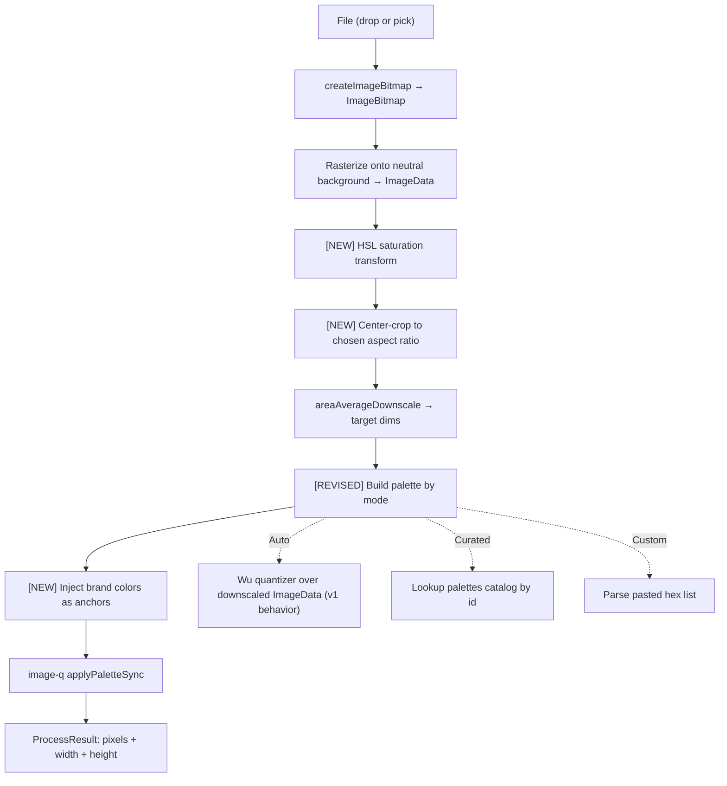

# feat: Pixel-Art Controls v2 (aspect ratio, palette, brand colors, saturation)

## Summary

Add the four control surfaces the README originally promised but v1 deferred: aspect-ratio crop, color-palette mode selector (auto / curated / custom), additive brand-color locking, and saturation. Each new control's default reproduces v1 behavior exactly, so the simple drop-and-resize flow keeps working unchanged. The new controls live in a collapsible "Advanced" panel below the resolution slider.

---

## Problem Frame

The v1 origin (`docs/brainstorms/2026-05-06-pixel-art-microfrontend-requirements.md`) deliberately deferred these four features to ship the simplest credible portfolio piece. The README still advertises them, the architecture is now stable, and the v1 worker pipeline is the right place to extend — area-average downscale and image-q Wu quantization both have natural insertion points for the new transforms. Shipping them as one v2 release avoids transient half-states (e.g., palette mode without brand-color injection, or saturation without aspect-ratio crop) and lets the README claims become accurate in a single deploy.

---

## Requirements

- R1. **Aspect-ratio control.** User can pick `Source` (preserve), `Square (1:1)`, `Portrait (3:4)`, `Landscape (4:3)`, or `Custom (W:H text input)`. Source image is center-cropped to the chosen ratio before downscale. `Source` reproduces v1 behavior.
- R2. **Palette mode selector.** Three modes: `Auto from image` (v1 default), `Curated`, `Custom`. The curated catalog ships statically in the repo and includes at minimum NES, Game Boy DMG, Game Boy Color, EGA-16, CGA-4, Commodore 64, PICO-8, and Sweetie 16. Custom mode accepts pasted hex codes (`#rgb` or `#rrggbb`), one per line or comma-separated, capped at 64 colors.
- R3. **Brand-color locking.** Optional list of hex codes. When set, the chosen palette is augmented with the brand colors as anchor points — they take precedence over quantized colors when palette slots are full. Additive only in v2 (no exclusive mode).
- R4. **Saturation control.** Slider from -1.0 (grayscale) to +1.0 (max), default 0.0 (neutral). Applied to source pixels in HSL space before downscale, so quantization sees already-adjusted colors.
- R5. **v1-default invariant.** With every new control left at its default (Source aspect, Auto palette, no brand colors, 0 saturation), the worker pipeline produces output bit-identical to v1 for the same input.
- R6. **Worker protocol.** New `ProcessRequest` fields are all optional; absence reproduces v1 behavior. No breaking change to v1's three-message protocol shape.
- R7. **Bundle budget.** Exposed `PixelArtApp` chunk grows by no more than ~5 KB gzipped over v1's 10 KB; curated palette data is small (a few hundred bytes per palette) so total dist size stays in a portfolio-friendly range.
- R8. **UI organization.** New controls live in a collapsible "Advanced" panel below the resolution slider; the panel is collapsed by default so v1's simple flow remains the primary surface.
- R9. **Tests.** Per-pipeline-stage unit tests in jsdom for saturation, crop, palette injection, brand-color injection. Component tests for the new controls. v1 invariant test (Source / Auto / no-brand / 0-sat input matches a v1-pipeline reference).

**Origin actors:** A1 (portfolio visitor), A2 (standalone visitor) — both apply unchanged.
**Origin flows:** F1 / F2 — same flows; the new controls extend the conversion step within both.
**Origin acceptance examples:** v1's AE1–AE4 still apply (they were defined for the existing controls and still hold). v2 doesn't introduce new AEs at this scope; the new test scenarios per unit serve the same role.

---

## Scope Boundaries

- **Dithering** of any kind — Floyd-Steinberg, Bayer, ordered. Origin Scope Boundaries deferred this and v2 does not revisit.
- **Importing palettes from a Lospec URL, image upload, or pasted PNG.** Custom mode in v2 = paste hex codes only.
- **Saved palette presets / "save my custom palette."** Would require URL state or localStorage; both deferred from v1 and stay deferred.
- **OkLCH or LAB color spaces** for saturation or palette distance. HSL is the v2 transform; perceptual upgrade is a follow-up if quality complaints emerge.
- **Smart aspect-ratio crop** (face / subject detection). v2 ships center-crop only.
- **Brand-color exclusivity mode** (output uses ONLY brand colors, nothing else). v2 is additive only.
- **Multi-image batch, animated transitions, undo/history.** Origin defers all three.
- **Mobile-first layout work** beyond "doesn't break on phones." Origin keeps desktop-primary; v2 inherits.

### Deferred to Follow-Up Work

- **Browser-mode integration tests for the new pipeline stages** — the v1 plan documented this gap (Vitest browser mode + Playwright). v2 does not add browser-mode coverage; pure-function jsdom tests stay the unit-level guard, and end-to-end verification stays in `docs/deploy.md`'s manual smoke test.
- **TypeScript types delivered to the host portfolio repo** — the host's `declare module 'remote/PixelArtApp'` shim has no props in v1 and stays that way in v2; the controls are internal state. No host-repo change needed for v2.

---

## Context & Research

### Relevant Code and Patterns

- **`apps/remote/src/pipeline/pixelArtWorker.ts`** — the worker's `handleProcess` function is the single insertion point for all four new pipeline stages. Order matters: saturation → crop → downscale → palette/brand injection.
- **`apps/remote/src/pipeline/protocol.ts`** — `ProcessRequest` already has `jobId`, `bitmap`, `targetLongEdge`. New fields will all be optional and absence-equals-v1-default.
- **`apps/remote/src/pipeline/quantize.ts`** — wraps image-q's `buildPaletteSync` + `applyPaletteSync`. The "build" step is what v2 replaces with palette-mode selection; the "apply" step stays nearly identical.
- **`apps/remote/src/pipeline/downscale.ts`** — pure function, takes `ImageData` + target dims. Aspect-ratio crop happens upstream; downscale only changes if the input dims change. Reusable as-is.
- **`apps/remote/src/components/ResolutionSlider.tsx`** — the pattern v2's new controls mirror: native `<input>` with explicit Tailwind dark/neutral styling, ARIA value+text, controlled value.
- **`apps/remote/src/exposes/PixelArtApp.tsx`** — owns the conversion state. v2 grows the state shape and threads new params through `usePixelArtPipeline.process(...)`.
- **`apps/remote/src/components/DropZone.tsx`** — established the disclosure / collapsible-section pattern (drag-over states + dismissible alert). v2's Advanced panel follows the same Tailwind styling vocabulary.

### Institutional Learnings

- v1 pushed all DOM/canvas work into the worker behind a transferable-`ImageBitmap` boundary; v2 keeps that boundary. Saturation, crop, downscale, and quantize all stay worker-side.
- v1's lifecycle test rig (jsdom + spy assertions on `URL.revokeObjectURL`, `bitmap.close`, worker termination) is the working baseline; v2 just extends it with new unit tests for the added pipeline stages.
- v1 surfaced one bug late (`getImageData` after `bitmap.close()` zeroes dims) — v2 keeps the "capture dims early" pattern in any new code that touches bitmaps.

### External References

No new external research for v2. Tech surface is unchanged: `image-q` (v1 dep), `OffscreenCanvas`, `ImageBitmap`, HSL color math (well-documented), Tailwind disclosure components (standard pattern).

---

## Key Technical Decisions

- **HSL for saturation, not OkLCH or LAB.** HSL is a 4-line transform per pixel; OkLCH requires a colorspace conversion library and adds bundle weight. Quality is sufficient for a portfolio tool; perceptual upgrade is a follow-up if complaints emerge.
- **Center-crop for aspect ratio, not smart crop.** Predictable behavior, zero ML, two-line math. Photographers who care about composition can crop their source first.
- **Static curated palette catalog in `apps/remote/src/pipeline/palettes.ts`.** No external fetch — eight named palettes shipped as a TypeScript record. Predictable bundle size, offline-safe, no Lospec API key.
- **Brand colors as additive anchors, not exclusive mode.** "Exclusive" (force every output pixel to be one of N brand colors) destroys photographic input. Additive injects brand colors into the chosen palette and lets quantization fill the rest.
- **Hex parser is forgiving but bounded.** Accepts `#rgb`, `#rrggbb`, optional `#`, whitespace and comma separators, case-insensitive. Capped at 64 colors per list — entries past index 63 are **silently truncated** (no error). Invalid token format (non-hex characters, wrong length) DOES surface as an inline error highlighting the bad token. The two paths are distinct: overflow is silent, malformed entries are loud.
- **All new `ProcessRequest` fields are optional with v1 defaults.** No breaking change. The worker reads `msg.saturation ?? 0`, `msg.aspectRatio ?? 'source'`, etc. R5's invariant (v1 defaults = v1 output) is enforced by an explicit reference test.
- **Pipeline order: saturation → crop → downscale → palette+brand-injection.** Saturation first means quantization sees the user's intent, not the original. Crop before downscale means the long-edge resolution applies to the cropped result, not the original. Palette + brand injection is one step (build merged palette, then apply).
- **Curated palettes use Wu quantizer to map source colors → palette colors.** image-q's `applyPaletteSync` with a fixed palette handles this; we don't re-build the palette per image.
- **UI organization: a `Disclosure`-style collapsible panel below the resolution slider.** Closed by default. v1 users see exactly what they saw before; v2 controls are one click away. Native `<details>` element styled with Tailwind — no extra dep, keyboard-accessible by default.
- **Brand-color injection differs by palette mode** (resolves a coherence contradiction caught in doc review):
  - **Auto** mode parameterizes Wu directly: target = `max(2, maxSize − brandColors.length)`, so Wu's quality optimization runs over the slots that survive instead of being wasted on entries that would be evicted. Brand colors then prepend to the reduced Wu output.
  - **Curated** and **Custom** modes use fixed palette data that can't be re-quantized to a smaller size. Brand colors prepend; if total exceeds `maxSize`, the trailing entries are evicted (the catalog can be reordered to control which entries take priority).
  - Common rule across modes: brand colors always occupy the first N slots of the resulting palette. The divergence is mechanical, not behavioral — users see brand colors winning equally in all modes; only the eviction strategy for the non-brand portion differs.

---

## Open Questions

### Resolved During Planning

- **Curated palette catalog choice**: NES, Game Boy DMG, Game Boy Color, EGA-16, CGA-4, Commodore 64, PICO-8, Sweetie 16. Established retro classics + two pixel-art community staples.
- **Custom palette parsing semantics**: forgiving hex format, max 64 colors, inline error feedback.
- **Brand-color additive vs exclusive**: additive (anchor points), per synthesis confirmation.
- **Saturation pipeline location**: pre-downscale, HSL space.
- **Aspect-ratio crop strategy**: center-crop, no smart-crop in v2.
- **Worker protocol shape**: optional fields, no breaking change.

### Deferred to Implementation

- **Exact palette-size budget for brand-color injection in `Auto` mode**: image-q's Wu quantizer takes a target color count (v1 hardcodes 16). When brand colors are present the quantizer asks for `16 - brandColors.length` slots. If `brandColors.length >= 16`, only the first 16 brand colors are used. Concrete numbers tuned during U5.
- **Tailwind class choices** for the collapsible Advanced panel and per-control labels — match the existing dark/neutral palette without bikeshedding now.
- **Whether the slider keyboard-jumps for saturation** match the resolution slider (Home/End for ends, PgUp/PgDn for larger steps). Native range input handles all of these; just verify in U2.

---

## High-Level Technical Design

> *This illustrates the intended approach and is directional guidance for review, not implementation specification. The implementing agent should treat it as context, not code to reproduce.*

The v2 worker pipeline extends v1 with three new stages and one revised stage. Order is load-bearing — saturation before crop, crop before downscale, palette + brand injection last:



UI shape:

```
PixelArtApp
├── DropZone (v1)
├── ResolutionSlider (v1, primary affordance)
├── <details> "Advanced" (collapsed by default)         ← U1
│   ├── SaturationSlider                                 ← U2
│   ├── AspectRatioSelect                                ← U3
│   ├── PaletteModeControl                               ← U4
│   │   ├── Mode radio: Auto / Curated / Custom
│   │   ├── CuratedPaletteSelect (visible when mode=Curated)
│   │   └── CustomPaletteTextarea (visible when mode=Custom)
│   └── BrandColorsTextarea                              ← U5
├── SideBySidePreview (v1)
└── Download PNG button (v1)
```

---

## Implementation Units

### U1. Advanced controls panel scaffold

**Goal:** Add the collapsible "Advanced" panel below the resolution slider, ready to host the four new controls. Verifies the disclosure UX and Tailwind layout before any feature lands inside.

**Requirements:** R8

**Dependencies:** None

**Files:**
- Create: `apps/remote/src/components/AdvancedControlsPanel.tsx`
- Modify: `apps/remote/src/exposes/PixelArtApp.tsx` (mount the panel below ResolutionSlider; pass children through)
- Test: `apps/remote/tests/components/AdvancedControlsPanel.test.tsx`

**Approach:**
- Use the native `<details>` / `<summary>` element styled with Tailwind. No JS state needed for open/closed — browser handles it. Keyboard-accessible by default (Enter/Space toggles).
- Closed by default. Summary shows "Advanced controls" with a subtle disclosure indicator (chevron via CSS).
- Children prop: any React node. v1 default render shows an empty disclosure that's a placeholder for the next four units.
- Match the existing dark/neutral Tailwind vocabulary (`border-neutral-800`, `bg-neutral-900`, `text-neutral-200`).

**Patterns to follow:**
- `apps/remote/src/components/ResolutionSlider.tsx` styling vocabulary
- `apps/remote/src/components/SideBySidePreview.tsx` rounded-card-with-border layout

**Test scenarios:**
- *Happy path*: panel renders closed by default; toggling the summary opens it and reveals children.
- *Happy path*: panel exposes its children prop in the open state for downstream tests.
- *Edge case*: keyboard activation (Enter/Space on the summary) toggles the panel.
- *Edge case*: with no children passed, summary still renders and toggles cleanly.

**Verification:**
- Mount in harness; panel sits below the resolution slider, closed; clicking the summary opens it with empty content. No console warnings.

---

### U2. Saturation slider + HSL transform

**Goal:** First feature into the Advanced panel — a saturation slider (-1.0 to +1.0, default 0) wired through to a new pipeline stage that applies an HSL saturation adjustment to source pixels before downscale.

**Requirements:** R4, R5, R6

**Dependencies:** U1

**Files:**
- Create: `apps/remote/src/pipeline/saturation.ts`
- Create: `apps/remote/src/components/SaturationSlider.tsx`
- Modify: `apps/remote/src/pipeline/pixelArtWorker.ts` (call saturation transform after rasterize, before downscale)
- Modify: `apps/remote/src/pipeline/protocol.ts` (add optional `saturation` field on `ProcessRequest`)
- Modify: `apps/remote/src/exposes/PixelArtApp.tsx` (state for saturation; pass through to pipeline)
- Modify: `apps/remote/src/hooks/usePixelArtPipeline.ts` (forward optional saturation arg through to the worker message)
- Test: `apps/remote/tests/pipeline/saturation.test.ts`, `apps/remote/tests/components/SaturationSlider.test.tsx`

**Approach:**
- `saturationAdjust(image: ImageData, amount: number): ImageData`. Per pixel: convert RGB→HSL, multiply S by `(1 + amount)` clamped to [0,1] when amount ≥ 0; for amount < 0, multiply S by `(1 + amount)` clamped at 0. Convert back to RGB. Alpha untouched. **The function explicitly short-circuits at `amount === 0` and returns the input ImageData unchanged** — this is what lets U2's first happy-path test assert byte-identical output at saturation=0, since RGB→HSL→RGB roundtrips on already-rounded 8-bit values are otherwise lossy. The worker pipeline ALSO short-circuits before calling the function (`msg.saturation ?? 0` reads 0 → skip), but the function-level guard is what makes the unit-test assertion reachable in isolation.
- Slider uses native `<input type="range" min={-1} max={1} step={0.05}>`. Display shows the rounded value (e.g. "+0.40", "0.00", "-0.30").
- Worker reads `msg.saturation ?? 0`. When 0, skip the transform step entirely (identity short-circuit) — preserves R5's bit-identical-to-v1 invariant exactly.
- ARIA value/text matches the resolution-slider pattern.

**Patterns to follow:**
- `apps/remote/src/pipeline/downscale.ts` (pure function on ImageData, alpha forced opaque)
- `apps/remote/src/components/ResolutionSlider.tsx` (control shape, ARIA, Tailwind)

**Test scenarios:**
- *Happy path*: saturation=0 returns pixel-identical output (literal byte equality of input.data and output.data).
- *Happy path*: saturation=-1 collapses every pixel to its grayscale equivalent (R=G=B). Verified against a small color-fixture ImageData.
- *Happy path*: saturation=+0.5 increases S of a known mid-saturation color (e.g., RGB(150, 100, 100)) and decreases distance to its hue's max-S equivalent.
- *Edge case*: pure grayscale input (R=G=B everywhere) is unchanged at any saturation value (S is already 0; +1 cannot increase it; -1 leaves it).
- *Edge case*: alpha is preserved for any saturation value (already-opaque source stays opaque; the function does not write 255 over an existing alpha).
- *Slider component happy path*: dragging emits values in the -1..+1 range with 0.05 step.
- *Slider edge case*: keyboard arrow keys move by step; Home/End jump to ends.
- *Integration*: PixelArtApp at saturation=0 produces pipeline output bit-identical to v1 (R5 invariant) — assert via a fixture round-trip with all v2 controls at default.

**Verification:**
- Drop a colorful photo in the harness; drag saturation to -1 and observe a grayscale result; drag to +1 and observe heightened color. saturation=0 is visually identical to v1.

---

### U3. Aspect-ratio selector + center-crop

**Goal:** Second feature — aspect-ratio dropdown with `Source` (default), `Square`, `Portrait (3:4)`, `Landscape (4:3)`, and `Custom (W:H)`. Source is center-cropped to the chosen ratio before downscale; output dimensions reflect the crop.

**Requirements:** R1, R5, R6

**Dependencies:** U1

**Files:**
- Create: `apps/remote/src/pipeline/crop.ts`
- Create: `apps/remote/src/components/AspectRatioSelect.tsx`
- Modify: `apps/remote/src/pipeline/pixelArtWorker.ts` (call crop after saturation, before downscale)
- Modify: `apps/remote/src/pipeline/protocol.ts` (add optional `aspectRatio` field — `'source' | { ratio: number }`; ratio = width/height)
- Modify: `apps/remote/src/exposes/PixelArtApp.tsx` (state + threading)
- Modify: `apps/remote/src/hooks/usePixelArtPipeline.ts` (forward arg)
- Test: `apps/remote/tests/pipeline/crop.test.ts`, `apps/remote/tests/components/AspectRatioSelect.test.tsx`

**Approach:**
- `centerCrop(image: ImageData, targetRatio: number): ImageData`. Compute the largest centered rectangle within source dims that has `width / height === targetRatio`. Copy those pixels into a fresh ImageData. `aspectRatio = 'source'` short-circuits to identity (preserves R5).
- Custom mode UI: two number inputs (W and H) constrained to [1, 50] each; ratio = W/H. Validates non-zero and non-NaN.
- Curated mode UI: a `<select>` with five options. The `Custom` option reveals the W/H inputs.
- Long-edge target dim still applies after crop — e.g., source 4000×3000 → square crop = 3000×3000 → at long-edge target 64 = 64×64.
- ARIA: `<label>` association on the select and the W/H inputs.

**Patterns to follow:**
- `apps/remote/src/pipeline/downscale.ts` (pure function, alpha 255, throws on degenerate input)
- `apps/remote/src/components/ResolutionSlider.tsx` (controlled component with disabled state)

**Test scenarios:**
- *Happy path*: aspect=`source` returns the input untouched (byte equality).
- *Happy path*: 4000×3000 with ratio 1:1 → 3000×3000 ImageData centered on the source.
- *Happy path*: 1000×2000 with ratio 4:3 → 1000×750 (crop the height).
- *Edge case*: ratio matches source ratio exactly → output equals input dims (no-op crop).
- *Edge case*: ratio greater than source ratio → height is preserved, width cropped.
- *Error path*: ratio ≤ 0 throws.
- *Edge case*: 1×1 source → 1×1 result regardless of ratio.
- *Component happy path*: selecting Square emits ratio 1; selecting Custom with W=16, H=9 emits ratio 16/9.
- *Component edge case*: Custom W=0 surfaces an inline validation message and does not emit.
- *Integration*: aspect=`source` + 0 saturation + auto palette + no brand colors at the same time produces v1-bit-identical output.

**Verification:**
- Drop a 4:3 photo, switch to Square, observe a centered crop. Output PNG dims match the chosen ratio at the chosen long-edge resolution.

---

### U4. Curated + custom palette modes

**Goal:** Third feature — palette mode selector with `Auto from image` (v1 default), `Curated` (8 retro palettes), and `Custom` (paste hex). Plumbing for image-q's `applyPaletteSync` against a fixed palette.

**Requirements:** R2, R5, R6, R7

**Dependencies:** U1

**Files:**
- Create: `apps/remote/src/pipeline/palettes.ts` (curated catalog)
- Create: `apps/remote/src/pipeline/parsePalette.ts` (custom hex parser)
- Create: `apps/remote/src/components/PaletteModeControl.tsx`
- Modify: `apps/remote/src/pipeline/quantize.ts` (accept optional fixed palette; when provided, skip Wu build and apply directly)
- Modify: `apps/remote/src/pipeline/pixelArtWorker.ts` (route by palette mode)
- Modify: `apps/remote/src/pipeline/protocol.ts` (add optional `paletteMode` + `curatedPaletteId` + `customPalette` fields)
- Modify: `apps/remote/src/exposes/PixelArtApp.tsx` (state + threading)
- Modify: `apps/remote/src/hooks/usePixelArtPipeline.ts` (forward args)
- Test: `apps/remote/tests/pipeline/palettes.test.ts`, `apps/remote/tests/pipeline/parsePalette.test.ts`, `apps/remote/tests/pipeline/quantize.test.ts` (extend), `apps/remote/tests/components/PaletteModeControl.test.tsx`

**Approach:**
- `palettes.ts` exports `CURATED_PALETTES: Record<CuratedPaletteId, { name: string; colors: [number, number, number][] }>`. Eight entries: NES (25 colors, commonly-used pixel-art subset of the full 54-color hardware palette), Game Boy DMG (4 greens), Game Boy Color (32 colors, a curated subset of the 32,768-color hardware capability), EGA-16, CGA-4 mode-1, Commodore 64 (16), PICO-8 (16), Sweetie 16 (16). Each palette's exact RGB tuples cite a named reference in a comment alongside the data.
- `parsePalette(input: string): { ok: true; colors: [number, number, number][] } | { ok: false; error: string; badToken?: string }`. Splits on whitespace and commas; accepts `#rgb`, `#rrggbb`, with or without `#`, case-insensitive. Caps at 64 colors. Returns first invalid token in the error path.
- `quantize.ts` accepts an optional `fixedPalette` argument. When provided, skips `buildPaletteSync` and uses `applyPaletteSync` with the provided palette; when absent, behaves exactly as v1 (Wu over the source).
- Worker: derive the palette to use based on `msg.paletteMode`. Auto → no `fixedPalette` (v1 path). Curated → look up `CURATED_PALETTES[msg.curatedPaletteId]`. Custom → use `msg.customPalette`.
- Component: radio group for mode; conditional content panes for Curated (a `<select>` with the eight options) and Custom (a textarea + parse-error display).

**Patterns to follow:**
- `apps/remote/src/pipeline/quantize.ts` for image-q wrapping
- `apps/remote/src/components/DropZone.tsx` for inline error rendering pattern

**Test scenarios:**
- *Happy path (palettes.ts)*: every catalog entry has 1–64 colors; every color is a valid `[r,g,b]` tuple of `0..255`.
- *Happy path (parsePalette)*: `"#ff0000\n#00ff00, #0000ff"` → 3 valid colors.
- *Happy path (parsePalette)*: shorthand `"#f00 #0f0 #00f"` → expanded 3-color list.
- *Edge case (parsePalette)*: leading/trailing whitespace and mixed separators → tokens still extracted.
- *Edge case (parsePalette)*: 65+ entries → returns the first 64 with a non-error info? No — returns ok with first 64, drops the rest (hard cap, predictable). Document behavior in the test.
- *Error path (parsePalette)*: `"not-a-color"` returns `{ ok: false, badToken: "not-a-color" }`.
- *Error path (parsePalette)*: empty string returns `{ ok: false, error: "empty" }`.
- *Happy path (quantize with fixed palette)*: applying the Game Boy DMG palette (4 greens) to an arbitrary photo produces output with at most 4 distinct colors, all within the palette set.
- *Happy path (quantize with fixed palette)*: applying a 16-color Sweetie 16 palette to a noisy 32×32 image produces ≤ 16 distinct colors.
- *Integration*: v1-default invariant — paletteMode=`auto` (no `fixedPalette` passed) reproduces v1 quantize output bit-for-bit.
- *Component happy path (PaletteModeControl)*: switching modes shows/hides the Curated select and Custom textarea correctly.
- *Component error path*: pasting invalid hex into the Custom textarea shows the parse error inline.

**Verification:**
- Drop a colorful photo. Switch to Curated → Game Boy DMG. Result reduces to four greens. Switch to Custom, paste `#000000\n#ffffff\n#ff0000`. Result becomes black + white + red.

---

### U5. Brand-color injection

**Goal:** Fourth feature — a textarea for brand colors that, when set, augments whatever palette mode is active so the brand colors are guaranteed to appear in the output. Additive only.

**Requirements:** R3, R5, R6

**Dependencies:** U4 (reuses `parsePalette` and `quantize`'s fixed-palette path)

**Files:**
- Create: `apps/remote/src/pipeline/brandColors.ts` (palette merge logic)
- Create: `apps/remote/src/components/BrandColorsTextarea.tsx`
- Modify: `apps/remote/src/pipeline/quantize.ts` (apply brand-color injection to whichever palette is in use)
- Modify: `apps/remote/src/pipeline/pixelArtWorker.ts` (pass brand colors through)
- Modify: `apps/remote/src/pipeline/protocol.ts` (add optional `brandColors: [number, number, number][]`)
- Modify: `apps/remote/src/exposes/PixelArtApp.tsx` (state + threading)
- Modify: `apps/remote/src/hooks/usePixelArtPipeline.ts` (forward arg)
- Test: `apps/remote/tests/pipeline/brandColors.test.ts`, `apps/remote/tests/components/BrandColorsTextarea.test.tsx`

**Approach:**
- `mergePalette(basePalette, brandColors, maxSize): RGB[]`. Prepend brand colors (deduped against base) to the base palette. Truncate to `maxSize` so brand colors take the first N slots. When `brandColors.length >= maxSize`, only the first `maxSize` brand colors are used.
- Auto mode + brand colors: `quantize` builds Wu palette at size `max(2, maxSize - brandColors.length)`, then merges brand colors in front. Wu sees the smaller target directly so its quality function isn't wasted on entries that would be evicted.
- Curated mode + brand colors: brand colors prepend to the curated set; if total exceeds the curated palette's natural size, trailing entries are evicted. Curated palettes are fixed data and can't be re-quantized to a smaller size, so eviction is the only available strategy.
- Custom mode + brand colors: brand colors prepend to the custom list; truncated at 64 total (the v2 parser cap).
- The textarea reuses `parsePalette` from U4 for input validation. Renders parse errors inline like Custom palette mode.
- maxSize default: 16 (matches v1 Wu default).

**Patterns to follow:**
- `apps/remote/src/pipeline/parsePalette.ts` from U4 for input parsing
- `apps/remote/src/components/DropZone.tsx` for error rendering

**Test scenarios:**
- *Happy path (mergePalette)*: 3 brand colors + 16-color base, maxSize=16 → 3 brand + first 13 base.
- *Happy path (mergePalette)*: 0 brand colors → base palette unchanged. (R5 invariant — no brand colors = v1 behavior preserved.)
- *Edge case (mergePalette)*: brand colors that already exist in base are deduped (not double-counted).
- *Edge case (mergePalette)*: brand colors length ≥ maxSize → only first maxSize brand colors used; base discarded.
- *Edge case (mergePalette)*: empty base palette + 4 brand colors → 4 brand colors as the full palette.
- *Integration (worker, Auto + brand)*: applying brand=`[#ff0000]` with auto mode produces output where pure red appears in the result palette. Verify by counting RGB(255, 0, 0) frequency in the output.
- *Integration (worker, Curated + brand)*: applying brand=`[#ff00ff]` with Game Boy DMG curated produces an output palette containing magenta even though Game Boy DMG has no purple.
- *Integration*: brandColors=[] with all other v2 controls at default → bit-identical to v1 output (R5).
- *Component error path*: invalid hex in the brand textarea surfaces inline; the pipeline does not fire with a partial parse.

**Verification:**
- With Curated → Game Boy DMG selected, set brand colors `#ff00ff #00ffff`. Result includes magenta and cyan alongside the four greens. With brand colors cleared, output reverts to just the four greens.

---

### U6. v1-default invariant test + bundle audit

**Goal:** Lock in R5 (v1 defaults reproduce v1 output exactly) with a single integration test, and confirm R7 (exposed chunk size grew within budget).

**Requirements:** R5, R7

**Dependencies:** U2, U3, U4, U5

**Files:**
- Create: `apps/remote/tests/pipeline/v1-invariant.test.ts`
- Modify: `apps/remote/scripts/verify-build.sh` (raise `MAX_EXPOSED_CHUNK_BYTES` if needed; document the budget delta)

**Approach:**
- Reference test: build a fixture ImageData, run it through the v2 worker pipeline with `saturation=0`, `aspectRatio='source'`, `paletteMode='auto'`, `brandColors=[]`. Compare the result to a separately-computed reference using the v1 pipeline (same downscale + Wu) on the same fixture. Bytes must match exactly. If they don't, R5 is violated.
- Bundle audit: build `apps/remote`, read the exposed `PixelArtApp` chunk size, log it. Update the verify script's ceiling to whatever v2 actually ships at, plus a small headroom (~2 KB). Document the v1→v2 delta in a comment.
- This unit lands last so it sees the full v2 surface in one place.

**Patterns to follow:**
- `apps/remote/scripts/verify-build.sh` for the ceiling pattern
- v1's existing fixture-based pipeline tests for the integration shape

**Test scenarios:**
- *Happy path (R5 invariant)*: a known fixture ImageData run through v2 with all v2 controls at default produces output bytes equal to the same fixture run through a v1-equivalent pipeline.
- *Negative control*: same fixture with `saturation=-1` produces output that is NOT byte-equal (sanity check that the test would actually catch a regression).

**Verification:**
- `pnpm test` and `pnpm --filter @pixelart/remote build` both pass with the updated bundle ceiling.

---

## System-Wide Impact

- **Interaction graph:** the worker pipeline picks up three new stages and one revised stage, all worker-side. The host portfolio's `RemoteTab` + Suspense + crash-boundary wrap is unchanged. The harness mounts the same component path. No host-repo changes required.
- **Error propagation:** new failure modes are inline UX errors (invalid hex in custom palette / brand colors, invalid custom aspect ratio). They surface in the affected control's local error UI, not via the worker error channel. Worker-level error handling stays as-is.
- **State lifecycle risks:** none new. Bitmaps and object URLs already get closed and revoked correctly in v1; v2 doesn't add new resources at the component level. The new pipeline stages are pure functions with no allocation surprises.
- **API surface parity:** the same exposed `PixelArtApp` component still loads identically in the federated host and the standalone harness. New fields on `ProcessRequest` are optional, so the v1→v2 protocol bump is forward-compatible with any v1-vintage caller (none exist outside this repo, but the discipline matters for future federated callers).
- **Integration coverage:** the v1-default invariant test (U6) is the single most important integration-level guard. If it passes, v1 users see no regression.
- **Unchanged invariants:** the host's `RemoteTab` contract — `() => Promise<{ default: ComponentType }>`, no props, no host context dependencies — is preserved exactly. Tailwind/shared-deps story unchanged. Static-deploy CORS config in `vercel.json` / `_headers` doesn't move.

---

## Risks & Dependencies

| Risk | Mitigation |
|------|------------|
| HSL saturation looks visually wrong on some images (over-saturates near-grayscale, under-saturates pure colors). | HSL is documented as a v2 trade-off in Key Technical Decisions. OkLCH upgrade is a deferred follow-up; quality-bar question only fires if real complaints emerge. |
| Brand-color injection conflicts with curated palettes (e.g., brand=`#ff00ff` with Game Boy DMG produces a 5-color palette that no longer feels "Game Boy"). | Documented additive-only semantics. The user opted in by adding brand colors; the result is honest about what they asked for. UX hint near the brand-colors textarea acknowledges the interaction. |
| Custom-palette parse errors confuse users (paste a list with one bad token, get blocked). | Inline error UI shows the bad token; the rest of the parse is preserved up to the failure point. Forgiving format (case-insensitive, multiple separators). |
| Bundle size grows past the verify-script ceiling, breaking CI on the v2 build. | U6 raises the ceiling intentionally with a small headroom, documenting the delta. If v2 grows by more than ~5 KB gzipped over v1, that's a flag to revisit (likely the curated palette catalog has too many entries). |
| Center-crop loses important parts of the source (e.g., a portrait with the subject not centered). | Documented v2 limitation. Smart crop is a deferred follow-up; users can pre-crop the source in their own editor. |
| New `ProcessRequest` fields accidentally break v1 in some host-portfolio combination. | Every new field is optional with a v1-equivalent default. The U6 invariant test asserts byte-equality; any inadvertent default change would surface immediately. |
| `<details>` element styling differs across browsers (especially Safari summary marker). | Standard, well-documented; minor cosmetic variance is acceptable. CSS reset on the marker handles most cases. |

---

## Documentation / Operational Notes

- **README.md** updates from v1's "currently live" section to reflect the now-shipped feature set. Move the four features out of "Deferred past v1" into the live capability list.
- **`docs/deploy.md`** is unchanged — same deploys, same CORS, same smoke test. The smoke-test recipe should mention spot-checking each new control during the manual end-to-end pass, but doesn't require new automated steps.
- No host-portfolio coordination needed. The TS module declaration `declare module 'remote/PixelArtApp'` still has no props and stays accurate.
- Worker bundle grows; CDN cache headers (`Cache-Control: public, max-age=31536000, immutable` on the hashed worker chunk) handle stale-asset risk.

---

## Sources & References

- **Origin document:** [`docs/brainstorms/2026-05-06-pixel-art-microfrontend-requirements.md`](../brainstorms/2026-05-06-pixel-art-microfrontend-requirements.md) — v1 brainstorm whose Scope Boundaries explicitly defer these four features.
- **Predecessor plan:** [`docs/plans/2026-05-06-001-feat-pixel-art-microfrontend-v1-plan.md`](2026-05-06-001-feat-pixel-art-microfrontend-v1-plan.md) — v1 architecture this v2 extends.
- Relevant code: `apps/remote/src/pipeline/pixelArtWorker.ts`, `apps/remote/src/pipeline/quantize.ts`, `apps/remote/src/pipeline/protocol.ts`, `apps/remote/src/exposes/PixelArtApp.tsx`.
- [`image-q` `applyPaletteSync` reference](https://github.com/ibezkrovnyi/image-quantization) — used in U4 and U5 for fixed-palette application.
- HSL color space transform: standard MDN reference, no library dep.
- Curated palette references: NES system palette, Game Boy DMG (DMG-CPU-01), Commodore 64 hardware palette, PICO-8 palette spec, Sweetie 16 palette by GrafxKid (CC-BY).
