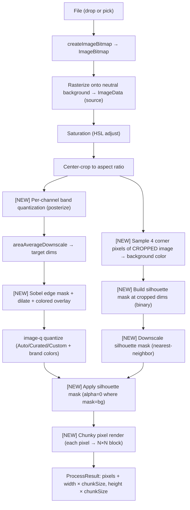

# feat: Pixel-Art Style Filters (v3)

## Summary

Add a top-level Style selector (Custom + 5 filter presets) plus four new pipeline transforms (outline, posterization, silhouette/background-removal, chunky pixels) and a user-controlled palette size, across seven implementation units. Filters populate all dials at once; new transforms also live as individual Advanced controls. Style=Custom + transforms-off + palette=16 reproduces v2 output bit-identically.

---

## Problem Frame

v2 shipped a flexible control surface but every output looks like the same kind of pixel art. The brainstorm reframed the tool as a game-asset producer: visitors picking up the tool to make loading-screen art, character portraits, units, weapons, or environments need stylistically distinct outputs without tuning ten controls per asset type. The pipeline literally cannot reach some of the looks (outlines, posterized cartoon flatness, silhouette cutouts, chunky retro pixels), so v3 adds those transforms. See origin `docs/brainstorms/2026-05-06-pixel-art-style-filters-requirements.md` for the full product framing.

---

## Requirements

Carried verbatim from origin (R1–R13). IDs preserved for traceability.

**Style selector**
- R1. Top-level Style selector with 6 options (`Custom`, `Art piece`, `Portrait`, `Units`, `Asset`, `Environment`) above the resolution slider.
- R2. Picking a non-Custom Style populates every dial — existing v2 controls + new v3 transforms — with the filter's curated defaults.
- R3. Tweaking any dial after applying a filter flips the selector to display `Custom (was: <filter>)` with a `Reset to <filter>` action.
- R4. Active Style persists across image drops within a session.

**Per-filter defaults** (load-bearing — see origin for the full table; planning may refine numerics during U6 but every cell is a product decision).

**New pipeline transforms (each independently exposed in Advanced)**
- R5. Outline transform: edge detection + line thickening + colored overlay before quantization. Width 1–3 px, configurable color.
- R6. Posterization transform: per-channel band reduction before palette quantization. 2–8 bands.
- R7. Silhouette/background-removal: corner-sample background color, threshold-replace with `alpha=0`. Tolerance configurable.
- R8. Chunky pixel transform: post-quantize render where each pixel is N×N block. N ∈ {1, 2, 3, 4}.

**Palette-size control**
- R9. Palette size becomes user-controlled in {8, 16, 24, 32, 48, 64, 96, 128}; default 16 preserves v2.

**Output and export**
- R10. PNG export preserves transparency when silhouette is on (no alpha=255 force).
- R11. Downloaded filename includes the active Style: `pixel-art-{style}-{w}x{h}.png` for non-Custom; `pixel-art-{w}x{h}.png` for Custom (v2 naming).

**v1/v2 invariant**
- R12. Style=Custom + every transform off + palette=16 produces output bit-identical to v2.

**Worker protocol**
- R13. Worker protocol gains optional fields for all new transforms; absence reproduces v2 behavior.

**Origin actors:** A1 (portfolio visitor), A2 (standalone visitor), A3 (game-asset producer — same human, different workflow framing).
**Origin flows:** F1 (portfolio embed), F2 (standalone), F3 (game-asset producer iterates through multiple sources with persistent Style — new in v3).
**Origin acceptance examples:** AE1 (Units populates all dials), AE2 (modifying flips to Custom indicator), AE3 (Asset+silhouette produces transparent PNG), AE4 (R12 invariant byte-equality), AE5 (Style persists across drops), AE6 (filename includes Style).

---

## Scope Boundaries

Carried verbatim from origin's Scope Boundaries:

- ML/AI segmentation for "always works" background removal — too heavy for the bundle budget.
- Subject-aware crop / face detection for Portrait — center-crop only.
- Per-filter outline color overrides — Advanced has one global color picker.
- Perceptual-space posterization (LAB/OkLCH) — RGB channels only.
- Filter preview thumbnails in the Style dropdown — names only.
- Intensity master knob interpolating between filter-off and filter-full.
- Custom filter saving/sharing/URL state.
- Tile, icon, sprite-frame filters — considered during brainstorm and explicitly deferred.
- Side-by-side multi-filter comparison view.
- Background replacement (only removal in v3).
- Skin-tone-aware palettes for Portrait.
- Animated transitions between filter changes.
- Filter recommendations based on source content.

### Deferred to Follow-Up Work

- (None — v3 ships the full surface in one sequence; no plan-local splits.)

---

## Context & Research

### Relevant Code and Patterns

- **`apps/remote/src/pipeline/pixelArtWorker.ts`** — the existing v2 pipeline (`source bitmap → composite → saturation → crop → downscale → quantize`) is the insertion point for the new stages. Pipeline order matters; see High-Level Technical Design.
- **`apps/remote/src/pipeline/protocol.ts`** — `ProcessRequest` already grew optional fields in v2 (`saturation`, `aspectRatio`, `fixedPalette`, `brandColors`). v3 grows ~7 more, same pattern.
- **`apps/remote/src/pipeline/quantize.ts`** — already accepts a `paletteSize` option (v2's `quantizePalette(image, { paletteSize })`); R9 just exposes it as a UI control + protocol field rather than always passing 16.
- **`apps/remote/src/pipeline/saturation.ts`** — pattern to mirror for the new pure-function transforms: explicit `if (param === default) return image;` short-circuit so each transform's R12 contribution is byte-identical at default.
- **`apps/remote/src/pipeline/parsePalette.ts`** — pattern for the silhouette tolerance UX (slider control + state in component, results threaded as parsed values to the worker).
- **`apps/remote/src/components/SaturationSlider.tsx`** + **`AspectRatioSelect.tsx`** — established Advanced-control vocabulary (Tailwind dark/neutral, ARIA labels, disabled prop, controlled value).
- **`apps/remote/src/components/PaletteModeControl.tsx`** — established pattern for a control with multiple sub-states (mode + sub-controls revealed conditionally). Useful reference for the filter-preset UI.
- **`apps/remote/src/exposes/PixelArtApp.tsx`** — owns all state. v3 grows the state shape and the dispatch effect's dependency array (which is already at 8 deps; will reach ~14 in v3 — acceptable, but worth flagging).
- **`apps/remote/src/pipeline/exportPng.ts`** — the alpha-force loop (`out[i+3] = 255`) needs removal for R10. Currently asserts opaque; v3 makes that conditional on whether the buffer carries silhouette alpha.

### Institutional Learnings

- v1's lifecycle test rig (jsdom + spy assertions for object-URL revocation, ImageBitmap close, worker termination) covers all v3 work without modification — every new transform is a pure function on ImageData with no resource lifecycle.
- v2's "function-level identity short-circuit + worker-level pre-check" pattern (saturation, aspectRatio) is the template for every new v3 transform's R12 contribution.
- v1 surfaced a runtime bug where `bitmap.close()` zeros dims — capture source dims before the close, before any transform that needs them. v3 inherits this; no new exposure since the new transforms operate on already-captured ImageData.
- v2's curated palettes (Game Boy DMG, PICO-8, EGA-16) are the catalog v3's filter defaults reuse — no new palettes required.

### External References

- **Sobel operator** — standard 3×3 kernel for edge detection. ~30 lines per axis; output magnitude is `sqrt(gx² + gy²)` thresholded.
- **Posterization formula** — `floor(channel * bands / 256) * 256 / (bands − 1)` produces evenly-spaced output values.
- No new dependencies required. `image-q` continues to handle quantization; everything else is pure JS on `Uint8ClampedArray`.

---

## Key Technical Decisions

- **Pipeline order**: source ImageBitmap → composite → saturation → crop → **posterization (NEW)** → downscale → **outline overlay (NEW)** → quantization → **apply silhouette mask (NEW)** → **chunky pixel render (NEW)**. Posterization runs before downscale so the bands survive area-averaging; outline runs at output resolution so 1-pixel widths are crisp; silhouette is applied at end on the quantized buffer because the mask is built from source corners and downscaled separately. Chunky pixels is the final render concern — it inflates output dims so the PNG carries the chunky scaling.

- **Sobel edge detection for outlines**: standard 3×3 horizontal + vertical kernels, magnitude threshold ~50/255 (tunable in code, not exposed). Output is a binary edge mask. Width control via 1-pixel dilation per (width − 1) iterations using 4-neighbor expansion. Outline color overlays input pixels at mask=true positions before quantization runs, so the quantizer sees the outline-painted image and palette assignment includes the outline color naturally.

- **Channel-quantization for posterization**: `floor(c * bands / 256) * 256 / (bands − 1)` per RGB channel, alpha untouched. Distinct from palette quantization: posterization shapes the gradient (how many distinct levels per channel exist), palette quantization picks which RGB tuples survive after color choice. Posterization runs before downscale so the bands are visible in the source-resolution image and survive area-averaging.

- **Post-crop corner-sample for silhouette** (revised from initial source-side approach per feasibility doc-review): build the mask AFTER `centerCrop` runs but BEFORE downscale. Sample the four corner pixels of the cropped image, threshold against tolerance, produce a binary mask at the cropped-image dims. Downscale the mask alongside the image using nearest-neighbor. Apply at end of pipeline by zeroing the alpha channel where mask = background. Source-side sampling pre-crop produced a coordinate mismatch between mask and image when aspect-ratio crop was active; post-crop sampling fixes that AND makes the corner sample honest about what the user actually sees.

- **Pre-baked chunky pixels**: when chunkSize > 1, the final output buffer has dims `(targetW * chunkSize) × (targetH * chunkSize)` with each pixel repeated. The PNG carries the chunky scaling at export time. Alternative (CSS-scaled at display) was rejected — the export wouldn't carry the chunky look, and the game-asset workflow needs the file to be the final asset.

- **Palette size as discrete dropdown**, not slider: values are {8, 16, 24, 32, 48, 64, 96, 128}. Sliders with 121 stops are noise; palette sizes have natural breakpoints.

- **Resolution slider gains two new stops** (per scope-guardian doc-review): the existing `ValidLongEdge` type and `VALID_LONG_EDGES` constant in `apps/remote/src/pipeline/protocol.ts` ship as `[16, 32, 64, 128, 256]` from v1. The Asset filter requires resolution 48 and the Environment filter requires 192 — neither is in the v1 list. U5 extends `VALID_LONG_EDGES` to `[16, 32, 48, 64, 96, 128, 192, 256]` (8 stops) so all 5 filters' resolution defaults are valid slider values. Adding 96 keeps the spacing reasonably uniform on the slider track. Type widening propagates through `ResolutionSlider`, `PixelArtApp` state, and the v3-invariant test (existing v2 stops still produce identical output). Filename derivation in U7 handles all 8 stops uniformly.

- **Disabled-when-no-image policy extends to all v3 controls.** The 5 new Advanced controls (PaletteSize, Outline, Posterization, Silhouette, ChunkyPixels) follow v2's "rendered at all times, `disabled` prop set when no image is loaded" policy. The new top-level **StyleSelector is enabled regardless of image-load state** — F3 (game-asset producer) needs to pre-arm a Style before the first drop. Picking a Style pre-load populates dial state but the pipeline only fires when an image is present (existing behavior).

- **Silhouette mask is built post-crop, not pre-crop.** Feasibility doc-review caught this: if the mask is built at full source dims and the image is then cropped, the mask coordinates no longer correspond to the cropped image's pixels — corner pixels of the cropped image are different than corner pixels of the source. Pipeline order revised: source → composite → saturation → crop → **build silhouette mask from cropped image's corners** → posterize → downscale (image and mask in parallel) → outline → quantize → apply mask → chunky render. Mask sampling on the cropped image makes the corner-sample more honest about what the user will see at the result's corners.

- **`outlineColor` equality** (per scope-guardian residual risk): `outlineColor` is an RGB tuple (`[number, number, number]`). The modified-state detection's array-equality check uses element-by-element comparison (or stringified comparison), not reference equality. Same applies to any other tuple-valued dial.

- **Style selector as native `<select>`** above the resolution slider, not radio buttons or button row. Six options → dropdown is conventional. "Custom (was: X)" text label + small "Reset to X" button below the dropdown when modified. No chip/badge/icon — keep textual.

- **Filter preset catalog as static data** in `apps/remote/src/filters.ts` mirroring the v2 curated-palettes pattern. Adding new filters in the future is a data-only change; no new components.

- **Modified-state detection**: when any dial changes after `applyFilter`, compare the new value to the active preset's expected value for that dial. First mismatch flips the indicator. Cheap (no diffing the whole state object — only the dial that just changed).

- **PNG export drops the alpha=255 force**. v2's `exportPng.ts` writes 255 into every alpha byte to ensure opaque output. v3 needs this conditional on whether silhouette was active — simplest: remove the force entirely and trust the buffer's alpha. Buffer is opaque when silhouette is off (matches v2 behavior); buffer carries 0/255 alpha when silhouette is on (matches R10).

- **Filename includes active Style** for non-Custom: `pixel-art-units-64x64.png`, `pixel-art-environment-192x144.png`. Custom keeps v2 naming `pixel-art-WxH.png`. Style names are kebab-case in the filename ("art-piece" not "Art piece").

- **Bundle ceiling raises from 23000 to 36000 bytes raw** (TBD by U7's measurement; 36000 is the conservative estimate based on 4 transform files + 5 component files + filter catalog data). Exact value set during U7 by `verify-build.sh`. Same enforcement pattern as v2.

- **No new dependencies**. `image-q` handles quantization; everything else is pure-JS on `Uint8ClampedArray` and `ImageData`. No edge-detection library, no segmentation library — keeps the bundle clean.

---

## Open Questions

### Resolved During Planning

- **Edge-detection algorithm**: Sobel (3×3 kernels), threshold ~50/255. Picked over Prewitt/difference-of-means for being the conventional choice with no meaningful runtime or quality difference at v3 sizes.
- **Posterization formula**: per-channel band quantization (`floor(c * bands / 256) * 256 / (bands − 1)`). Standard, deterministic, composes cleanly with the existing Wu quantizer that runs after.
- **Silhouette tolerance default**: tolerance starts at 12/255 (~5% threshold). Tunable in U3's component test; refined during implementation against real photos.
- **Chunky-pixels render strategy**: pre-baked into output buffer dims. PNG export carries the chunky size.
- **Pipeline order**: see Key Technical Decisions and HLTD diagram.
- **Palette-size UX**: dropdown, not slider.
- **Style selector UX**: native `<select>` dropdown.
- **"Custom (was: X)" indicator visual**: text + small Reset button.

### Deferred to Implementation

- **Sobel threshold value**: starts at 50/255 in U1; final value tuned against the per-filter visual results during U6 integration.
- **Chunky pixels max value**: U4 uses 4 as the max per origin R8; could relax to 8 if user feedback says 4 is too tame. Treat 4 as the v3 ceiling.
- **Reset button positioning** relative to the Style dropdown: inline right of the label, or stacked below. Design call during U6 — both are viable.
- **Bundle ceiling exact value**: U7 measures the v3 build and sets the ceiling at measured + 2 KB headroom, same as v2's pattern.
- **Edge detection on color input vs grayscale**: U1 picks during implementation. Sobel on grayscale (luminance) is simpler and usually visually equivalent; Sobel on color (per-channel max gradient) catches more edges but is more compute. Probably start grayscale.

---

## High-Level Technical Design

> *This illustrates the intended approach and is directional guidance for review, not implementation specification. The implementing agent should treat it as context, not code to reproduce.*

The v3 worker pipeline extends v2 with **four new stages and one revised stage**. Pipeline order is load-bearing — posterization before downscale (bands survive area-averaging), outline at output resolution (crisp 1-pixel lines), silhouette mask applied at end (mask built at source, downscaled alongside image, alpha applied last):



**UI shape** (changes from v2 in bold):

```
PixelArtApp
├── DropZone (v1)
├── **StyleSelector (NEW, top-level)**            ← U6
│   ├── <select> with 6 options
│   └── "Custom (was: X)" + Reset button (when modified)
├── ResolutionSlider (v1)
├── <details> "Advanced" (v2)
│   ├── SaturationSlider (v2)
│   ├── AspectRatioSelect (v2)
│   ├── PaletteModeControl (v2)
│   ├── BrandColorsTextarea (v2)
│   ├── **PaletteSizeControl (NEW)**                ← U5
│   ├── **OutlineControl (NEW)**                    ← U1
│   ├── **PosterizationControl (NEW)**              ← U2
│   ├── **SilhouetteControl (NEW)**                 ← U3
│   └── **ChunkyPixelsControl (NEW)**               ← U4
├── SideBySidePreview (v1)
└── Download PNG button (v1, **filename + alpha tweaks in U7**)
```

---

## Implementation Units

### U1. Outline transform

**Goal:** Sobel edge detection + line thickening + colored overlay, exposed as an Advanced control. Off by default reproduces v2 byte-for-byte.

**Requirements:** R5, R12, R13

**Dependencies:** None

**Files:**
- Create: `apps/remote/src/pipeline/outline.ts`
- Create: `apps/remote/src/components/OutlineControl.tsx`
- Modify: `apps/remote/src/pipeline/pixelArtWorker.ts` (insert outline stage after downscale, before quantize)
- Modify: `apps/remote/src/pipeline/protocol.ts` (add `outlineEnabled`, `outlineWidth`, `outlineColor` optional fields)
- Modify: `apps/remote/src/exposes/PixelArtApp.tsx` (state + threading)
- Modify: `apps/remote/src/hooks/usePixelArtPipeline.ts` (forward outline options)
- Test: `apps/remote/tests/pipeline/outline.test.ts`, `apps/remote/tests/components/OutlineControl.test.tsx`

**Approach:**
- `applyOutline(image: ImageData, options: { enabled, width, color }): ImageData`. enabled=false short-circuits to identity (returns input — same reference).
- Sobel on luminance: `Y = 0.299*R + 0.587*G + 0.114*B`. Compute `gx`, `gy` via 3×3 kernels; magnitude `sqrt(gx² + gy²)`; threshold at 50/255 to produce binary edge mask.
- Dilation: each pass expands the mask by 1 pixel in 4-neighbor directions. Run `width − 1` passes.
- Overlay: for each output pixel where mask is true, replace with the outline color.
- Default outline color: black `[0, 0, 0]`. Default width: 1. Both Advanced-controllable.

**Patterns to follow:**
- `apps/remote/src/pipeline/saturation.ts` for the function-level identity short-circuit pattern.
- `apps/remote/src/components/AspectRatioSelect.tsx` for the dropdown + sub-control component shape.

**Test scenarios:**
- *Happy path*: solid-color image (no edges) with outline enabled returns input byte-identical (no edges → no overlay).
- *Happy path*: high-contrast image (white square on black) produces outline pixels along the rectangle boundary.
- *Happy path*: width=2 produces a strictly thicker outline than width=1 (count of outline-colored pixels increases).
- *Happy path*: red outline on a green source produces red overlay pixels along edges.
- *Edge case (R12)*: enabled=false returns the input ImageData (same reference, byte-identical) — covers the v2 invariant contribution.
- *Edge case*: width=0 is treated as enabled=false (defensive — no overlay). Validate or clamp.
- *Edge case*: 1×1 input ImageData returns input unchanged (no edge possible).
- *Component happy path*: OutlineControl emits onChange with enabled toggle + width + color.
- *Component edge case*: OutlineControl shows the color picker only when enabled.

**Verification:**
- Drop a high-contrast photo in the harness with outline enabled, width=2, black: result has visible thick black outlines around forms.
- With outline disabled, result is byte-identical to v2 output for same source.

---

### U2. Posterization transform

**Goal:** Per-channel band reduction before downscale. Bands survive area-averaging; gradient flattens into stepped color regions.

**Requirements:** R6, R12, R13

**Dependencies:** None

**Files:**
- Create: `apps/remote/src/pipeline/posterize.ts`
- Create: `apps/remote/src/components/PosterizationControl.tsx`
- Modify: `apps/remote/src/pipeline/pixelArtWorker.ts` (insert before downscale, after crop)
- Modify: `apps/remote/src/pipeline/protocol.ts` (add `posterizeBands` optional field — undefined or 0 = disabled)
- Modify: `apps/remote/src/exposes/PixelArtApp.tsx`, `apps/remote/src/hooks/usePixelArtPipeline.ts`
- Test: `apps/remote/tests/pipeline/posterize.test.ts`, `apps/remote/tests/components/PosterizationControl.test.tsx`

**Approach:**
- `posterize(image: ImageData, bands: number | undefined): ImageData`. undefined or 0 short-circuits to identity. bands < 2 throws (degenerate).
- Per-pixel: `out_r = floor(in_r * bands / 256) * 256 / (bands − 1)` clamped 0–255. Same for G and B. Alpha untouched.
- Bands range 2–8; UI dropdown with values {2, 3, 4, 5, 6, 8}.

**Patterns to follow:**
- `apps/remote/src/pipeline/saturation.ts` for the identity short-circuit.
- `apps/remote/src/components/ResolutionSlider.tsx` for the dropdown-with-discrete-values component shape.

**Test scenarios:**
- *Happy path*: bands=undefined returns input byte-identical.
- *Happy path*: bands=4 maps each channel to one of 4 evenly-spaced levels. Exact output values depend on the formula: with `floor(c * 4 / 256) * 256 / 3` the levels round to `{0, 85, 171, 255}` (the 170.67 third level rounds up). Implementer picks the formula that produces clean integers — the test asserts whichever set the chosen formula actually produces, with at most 4 distinct values per channel.
- *Happy path*: a smooth gradient becomes 4 distinct step regions with bands=4.
- *Edge case (R12)*: bands=undefined + all v2 controls at default → byte-identical to v2 output.
- *Edge case*: bands=2 produces output where each channel is exactly 0 or 255.
- *Error path*: bands=1 throws.
- *Error path*: bands=0 disables (matches undefined behavior — no throw).
- *Component happy path*: PosterizationControl emits onChange with bands value.

**Verification:**
- Photographic source with bands=4 visibly steps gradients into 4-level color regions.
- With bands=undefined, output byte-identical to v2 in the v1-invariant test (extended in U7).

---

### U3. Silhouette / background-removal transform

**Goal:** Source-corner-sample background detection + binary mask + alpha-zero application at end of pipeline.

**Requirements:** R7, R10, R12, R13

**Dependencies:** None

**Files:**
- Create: `apps/remote/src/pipeline/silhouette.ts` (`sampleBackgroundColor`, `buildMask`, `applyMask`, `downscaleMask`)
- Create: `apps/remote/src/components/SilhouetteControl.tsx`
- Modify: `apps/remote/src/pipeline/pixelArtWorker.ts` (sample at source, build mask, downscale alongside image, apply at end)
- Modify: `apps/remote/src/pipeline/protocol.ts` (add `silhouetteEnabled`, `silhouetteTolerance` optional fields)
- Modify: `apps/remote/src/exposes/PixelArtApp.tsx`, `apps/remote/src/hooks/usePixelArtPipeline.ts`
- Test: `apps/remote/tests/pipeline/silhouette.test.ts`, `apps/remote/tests/components/SilhouetteControl.test.tsx`

**Approach:**
- `sampleBackgroundColor(image)`: read the four corner pixels, average their RGB → background color.
- `buildMask(image, bgColor, tolerance)`: produce ImageData where alpha=0 means "this pixel is background" (within tolerance) and alpha=255 means "foreground". RGB channels are unused (we only consume alpha).
- `downscaleMask(mask, targetW, targetH)`: nearest-neighbor downscale to target dims. Binary mask must remain binary; area-averaging would produce alpha mid-values that don't translate to clean cutouts.
- `applyMask(quantizedImage, mask)`: for each pixel, if mask alpha is 0, set output alpha = 0; else preserve quantizedImage alpha (255 from v2 invariant).
- Worker pipeline: corner-sample on the rasterized source (post-composite, pre-saturation); build mask at source dims; downscale mask alongside the main image (after the regular downscale step, in parallel); apply at end of pipeline before chunky-render.
- Tolerance: 0–30 of 255 (~12% threshold ceiling). Default 12.
- enabled=false short-circuits all silhouette steps in the worker (no sampling, no mask build, no application).

**Patterns to follow:**
- `apps/remote/src/pipeline/downscale.ts` for the nearest-neighbor downscale logic (mask version is simpler — no area-averaging, just sample the source pixel at the proportional source coordinate).
- `apps/remote/src/components/SaturationSlider.tsx` for the slider component shape (tolerance is continuous-ish, slider feels right unlike palette size).

**Test scenarios:**
- *Happy path (sampleBackgroundColor)*: white-cornered image returns ~(255, 255, 255).
- *Happy path (buildMask)*: image with white corners + colored center produces mask with alpha=0 at corners, alpha=255 in center.
- *Happy path (applyMask)*: applying the mask zeroes alpha at masked positions.
- *Happy path (downscaleMask)*: 100×100 mask downscaled to 25×25 preserves binary semantics (no alpha mid-values).
- *Edge case (R12)*: enabled=false → input image returned unchanged (alpha=255 throughout).
- *Edge case (sampleBackgroundColor)*: image with 4 different corner colors averages them (acceptable — user will see imperfect cutout and pick a different source).
- *Edge case (buildMask)*: tolerance=0 only matches exact background color; tolerance=30 matches a wide range.
- *Edge case (downscaleMask)*: 1×1 mask returns 1×1 mask unchanged.
- *Component happy path*: SilhouetteControl emits onChange with enabled + tolerance.
- *Integration*: full pipeline with silhouette enabled on a white-bg test fixture produces output where corner pixels have alpha=0 and central pixels have alpha=255.
- *Covers AE3*: Asset filter preset enables silhouette; on a clean-background source, the result PNG carries transparent corners and opaque subject.

**Verification:**
- Drop a photo of an object on a clean white background with silhouette enabled in the harness: result canvas shows the subject with transparent background (visible against the dark Tailwind backdrop).
- With silhouette disabled, output is byte-identical to v2 (covered by U7 invariant test).

---

### U4. Chunky pixel render

**Goal:** Final-pass pixel multiplication. Each output pixel becomes an N×N block; output buffer dimensions inflate accordingly.

**Requirements:** R8, R12, R13

**Dependencies:** None

**Files:**
- Create: `apps/remote/src/pipeline/chunky.ts`
- Create: `apps/remote/src/components/ChunkyPixelsControl.tsx`
- Modify: `apps/remote/src/pipeline/pixelArtWorker.ts` (final stage before postMessage)
- Modify: `apps/remote/src/pipeline/protocol.ts` (add `chunkSize` optional field — undefined or 1 = no-op)
- Modify: `apps/remote/src/exposes/PixelArtApp.tsx`, `apps/remote/src/hooks/usePixelArtPipeline.ts`
- Test: `apps/remote/tests/pipeline/chunky.test.ts`, `apps/remote/tests/components/ChunkyPixelsControl.test.tsx`

**Approach:**
- `chunkify(image: ImageData, chunkSize: number): ImageData`. chunkSize=1 short-circuits to identity. Else output is `(width * chunkSize) × (height * chunkSize)` with each input pixel repeated as an N×N block.
- Pure pixel-copy; no math beyond index arithmetic.
- Output dims propagate to the worker's `ProcessResult.width / .height`, so the result canvas in PixelArtApp displays the chunky resolution and PNG export carries it.
- Component is a dropdown with values {1, 2, 3, 4}.

**Patterns to follow:**
- `apps/remote/src/pipeline/saturation.ts` for short-circuit.
- Component dropdown follows `apps/remote/src/components/AspectRatioSelect.tsx` pattern.

**Test scenarios:**
- *Happy path*: chunkSize=1 returns input byte-identical (same reference).
- *Happy path*: chunkSize=2 on a 4×4 input produces an 8×8 output where each input pixel is a 2×2 block.
- *Happy path*: chunkSize=3 produces a 3× output in each dimension.
- *Edge case*: 1×1 input with chunkSize=4 produces a 4×4 output of identical pixels.
- *Edge case*: alpha is preserved per-pixel (transparent input pixel produces a transparent N×N block).
- *Error path*: chunkSize=0 throws (degenerate).
- *Error path*: chunkSize=5 (above max) is rejected at the protocol boundary or clamped — pick during implementation.
- *Component happy path*: ChunkyPixelsControl emits onChange with the picked size.

**Verification:**
- Drop a photo with chunky=2 enabled in the harness: result canvas shows visibly chunkier output at 2× the resolution.
- chunky=1 is byte-identical to v2 (covered by U7 invariant test).

---

### U5. Palette-size control

**Goal:** Expose `paletteSize` as a user-controlled value in {8, 16, 24, 32, 48, 64, 96, 128}. Default stays 16 (preserves v2). `quantize.ts` already accepts the option from v2 — this unit just wires the UI and protocol.

**Requirements:** R9, R12, R13

**Dependencies:** None

**Files:**
- Create: `apps/remote/src/components/PaletteSizeControl.tsx`
- Modify: `apps/remote/src/pipeline/protocol.ts` (`paletteSize` optional field — undefined defaults to 16)
- Modify: `apps/remote/src/pipeline/pixelArtWorker.ts` (forward `msg.paletteSize` into `quantizePalette({ paletteSize })`)
- Modify: `apps/remote/src/exposes/PixelArtApp.tsx`, `apps/remote/src/hooks/usePixelArtPipeline.ts`
- Test: `apps/remote/tests/components/PaletteSizeControl.test.tsx`; extend `apps/remote/tests/pipeline/quantize.test.ts` with paletteSize=8 and paletteSize=128 cases (verify the quantizer respects the size).

**Approach:**
- `quantize.ts` already exposes `paletteSize` as an option (v2 work). U5 just plumbs the user value through.
- Component is a dropdown with the 8 discrete values. Default 16.
- Protocol field is optional; absence treated as 16 by the worker (preserves R12).

**Patterns to follow:**
- `apps/remote/src/components/AspectRatioSelect.tsx` for the dropdown pattern.
- `apps/remote/src/pipeline/quantize.ts` already accepts this option — reuse without modification.

**Test scenarios:**
- *Happy path*: paletteSize=8 on a noisy image produces ≤ 8 distinct colors (extends v2's quantize.test.ts).
- *Happy path*: paletteSize=128 on a noisy image produces up to 128 distinct colors.
- *Happy path*: paletteSize=undefined behaves identically to paletteSize=16 (R12 invariant — verified in U7).
- *Edge case*: paletteSize=8 with 3-color custom palette → output uses only the 3 palette colors (palette size cap doesn't add colors that aren't in the user palette).
- *Component happy path*: PaletteSizeControl renders all 8 dropdown options; emits onChange with the value.
- *Component edge case*: dropdown defaults to 16 when value is undefined.

**Verification:**
- Drop a photo with paletteSize=48 in the harness: result has noticeably more color diversity than the default 16. With paletteSize=8, result is starkly limited.

---

### U6. Filter preset catalog + Style selector + apply logic

**Goal:** The integrating unit. Filter preset data, Style selector UI, batch dial-update logic, modified-state detection, "Custom (was: X)" indicator + Reset button.

**Requirements:** R1, R2, R3, R4

**Dependencies:** U1, U2, U3, U4, U5 (filters reference values for all new transforms)

**Files:**
- Create: `apps/remote/src/filters.ts` (catalog of 5 filter presets with all dial values per the origin's per-filter table)
- Create: `apps/remote/src/components/StyleSelector.tsx`
- Modify: `apps/remote/src/exposes/PixelArtApp.tsx` (new state: `activeFilter: FilterId | "custom" | "modified"`; new handler: `applyFilter(id)` that batch-sets all dials; modified detection on every dial change)
- Test: `apps/remote/tests/filters.test.ts`, `apps/remote/tests/components/StyleSelector.test.tsx`, extend `apps/remote/tests/integration/render.test.tsx` (in apps/harness/) to cover filter-apply integration.

**Approach:**
- `filters.ts` exports `FILTERS: Record<FilterId, FilterPreset>` where `FilterPreset` carries every dial's expected value (resolution, aspect ratio, palette mode, palette ID or custom hex, brand colors, saturation, paletteSize, outlineEnabled, outlineWidth, outlineColor, posterizeBands, silhouetteEnabled, silhouetteTolerance, chunkSize). Five entries: art-piece, portrait, units, asset, environment per the origin table.
- `StyleSelector` is a `<select>` with 6 options (Custom + 5 filters). When activeFilter is set, shows the dropdown current. When user has tweaked, shows "Custom (was: X)" text + small "Reset to X" button below the dropdown. Picking the dropdown to a filter calls `applyFilter`.
- `applyFilter(id)` in PixelArtApp: rely on React 18's automatic batching of multiple `setState` calls within an event handler — all dial updates land in one render. Do NOT use `flushSync` here; it would force synchronous renders between calls (the opposite of the intended batching). If a single transactional update is preferred for clarity, refactor the dials into a `useReducer` with a `SET_ALL` action.
- Modified detection: on every dial-change handler, after the new value is set, compare to the active preset's expected value. If activeFilter is "custom", no comparison needed. If activeFilter is a real filter and any dial diverges from the preset, flip activeFilter to "modified" state (UI shows "Custom (was: X)"). Tracking variable: `wasFilter` carries the last-applied filter ID so the "Reset to X" button knows what to re-apply.
- Reset button: re-runs `applyFilter(wasFilter)`.

**Technical design:** *(directional — not implementation specification)*

```
state shape (PixelArtApp):
  ...all v1/v2 dials...
  paletteSize: number       // U5
  outline: { enabled, width, color }   // U1
  posterizeBands: number | undefined   // U2
  silhouette: { enabled, tolerance }   // U3
  chunkSize: number         // U4
  activeFilter: FilterId | "custom" | "modified"
  wasFilter: FilterId | null   // tracks the last-applied filter when activeFilter is "modified"

applyFilter(id):
  preset = FILTERS[id]
  setAll(...preset)        // batch state update
  setActiveFilter(id)
  setWasFilter(null)

onAnyDialChange(dialKey, newValue):
  setDial(dialKey, newValue)
  if (activeFilter !== "custom" && activeFilter !== "modified"):
    if (newValue !== FILTERS[activeFilter][dialKey]):
      setActiveFilter("modified")
      setWasFilter(activeFilter)
```

**Patterns to follow:**
- `apps/remote/src/pipeline/palettes.ts` for the static-data catalog pattern.
- `apps/remote/src/components/PaletteModeControl.tsx` for the dropdown + conditional sub-content pattern.

**Test scenarios:**
- *Happy path (filters.ts)*: each filter has values for every dial (no missing keys). Verify shape exhaustively against the dial schema.
- *Happy path (Covers AE1)*: applying the "units" filter populates resolution=64, palette mode=curated PICO-8, saturation=+0.30, aspect=square, outline thick black, posterization=4, silhouette off, chunky=2.
- *Happy path (Covers AE2)*: applying "units" then nudging saturation from +0.30 to +0.20 → activeFilter flips to "modified" with wasFilter="units"; UI shows "Custom (was: Units)".
- *Happy path (Covers AE5)*: applying "asset" then dropping a new image without changing any dial → activeFilter remains "asset"; new conversion uses Asset preset values.
- *Happy path*: clicking "Reset to Units" after modifying re-applies the Units preset; activeFilter returns to "units".
- *Edge case*: applying the same filter twice in a row is a no-op (state unchanged).
- *Edge case*: applying a filter while another is active (e.g., "art-piece" → "units") replaces all dials with the new preset; activeFilter switches; wasFilter resets to null.
- *Edge case*: picking "Custom" from the dropdown clears activeFilter to "custom" without changing any dial values.
- *Component happy path (StyleSelector)*: renders 6 options; emits the picked filter ID.
- *Component edge case (StyleSelector)*: shows "Custom (was: X)" + Reset button only when activeFilter === "modified".
- *Integration (harness)*: drop image → pick "asset" → result has expected default values for all dials → drop second image → result still uses Asset preset (Style persists).

**Verification:**
- Each filter visibly produces its intended look in the harness. Switching between filters with the same source produces clearly distinct outputs.
- Modifying any dial after picking a filter shows the "Custom (was: X)" indicator. Clicking Reset returns to the filter's defaults.
- Style persists when a new image is dropped (no reset on file change).

---

### U7. PNG export with alpha + Style filename + bundle ceiling

**Goal:** Final unit — drop the alpha=255 force in exportPng, add Style to the filename, raise the bundle ceiling to v3's measured value, and extend the v2-invariant test to cover Style=Custom + all transforms off.

**Requirements:** R10, R11, R12

**Dependencies:** U1, U2, U3, U4, U5, U6

**Files:**
- Modify: `apps/remote/src/pipeline/exportPng.ts` (remove alpha=255 force; trust buffer alpha)
- Modify: `apps/remote/src/exposes/PixelArtApp.tsx` (pass active filter ID to download for filename)
- Modify: `apps/remote/scripts/verify-build.sh` (raise `MAX_EXPOSED_CHUNK_BYTES` to v3-measured value + 2 KB headroom)
- Modify: `apps/remote/tests/pipeline/exportPng.test.ts` (extend with alpha-preserved + Style-filename tests)
- Modify: `apps/remote/tests/pipeline/v1-invariant.test.ts` (extend reference pipeline to assert byte-equality with all v3 transforms set to off / default)

**Approach:**
- `exportPng.ts` currently writes 255 into every alpha byte. Remove that force loop. Buffer alpha is already correct: opaque (255) when silhouette is off, mixed (0/255) when silhouette is on.
- `pngFilename(width, height, style)`: when style ∈ filter IDs, return `pixel-art-${style-kebab}-${w}x${h}.png`; when style === "custom" or undefined, return `pixel-art-${w}x${h}.png` (v2 naming preserved).
- v2-invariant test: extend the reference pipeline to also pass through all v3 stages with default/off values; assert byte-equality. This is the R12 anchor for v3.
- Bundle ceiling: build, measure, set ceiling to (measured + 2000) bytes. Document the v2 → v3 delta in a verify-build.sh comment.

**Patterns to follow:**
- v2's `exportPng.ts` for the file structure; just remove the alpha-force loop.
- v2's `verify-build.sh` ceiling rationale comment (v1 → v2 delta) — same pattern for v2 → v3.

**Test scenarios:**
- *Happy path (Covers AE3)*: pixel buffer with mixed alpha (0 and 255) produces a PNG that opens with transparency intact.
- *Happy path (Covers AE6)*: pngFilename(64, 48, "environment") returns "pixel-art-environment-64x48.png".
- *Happy path*: pngFilename(64, 64, "custom") returns "pixel-art-64x64.png" (v2 naming).
- *Happy path*: pngFilename(64, 48, undefined) returns "pixel-art-64x48.png" (v2 naming).
- *Edge case*: Style names with spaces (e.g., "Art piece") kebab-case in filename → "art-piece".
- *Edge case (Covers AE4)*: v2 invariant — fixture ImageData through v3 pipeline with Style=Custom + all v3 transforms at default-off + paletteSize=16 produces output bytes equal to v2's pipeline output for the same source.
- *Edge case*: opaque buffer (no silhouette) still exports cleanly — no alpha changes.

**Verification:**
- Manual smoke test: download Asset filter output of a clean-background source; PNG opens with transparent background.
- Manual smoke test: download from each filter; filenames carry the Style name.
- v2-invariant test passes (R12 anchor).
- `pnpm --filter @pixelart/remote build` passes verify with the new ceiling.

---

## System-Wide Impact

- **Interaction graph**: the worker pipeline grows from 4 stages to 8. Order is load-bearing (see HLTD). The Suspense + crash-boundary wrap from the host is unchanged. The harness's StrictMode-off posture from v1 is unchanged. The portfolio host's `RemoteTab` contract is unchanged.
- **Error propagation**: new inline UX errors live on the new Advanced controls (invalid posterization bands, invalid silhouette tolerance, invalid outline width) — surface in their own components, don't propagate to the worker. Worker errors continue to use the existing WorkerError protocol; no new error codes needed.
- **State lifecycle risks**: PixelArtApp's state shape grows by ~10 fields. Effect dependency arrays grow accordingly (the dispatch effect already has 8 deps; v3 reaches ~14). React will re-render more often on dial change — but each new transform's pure function is fast (sub-millisecond on typical sizes), and the worker's debounce + jobId discard already handles slider drag.
- **API surface parity**: same single exposed `PixelArtApp` component. ProcessRequest grows ~7 new optional fields, all v2-equivalent on absence. No new exposed surface. Host portfolio TS declaration (`declare module 'remote/PixelArtApp'`) is unchanged — the component still takes no props.
- **Integration coverage**: the v2-invariant test (now v3-invariant after U7) is the single most important integration guard. If it passes, v2 users see no regression. The filter-apply integration test in U6 covers the cross-component dial-batching behavior that unit tests alone won't catch.
- **Unchanged invariants**: `RemoteTab` contract (no props, default-export only), Tailwind dark/neutral aesthetic, Module Federation shared-deps story (React + react-dom singletons), static-deploy CORS headers, `vite build && verify-build.sh` build flow. All unchanged.
- **Bundle size growth**: v3 measurably grows. Plan raises the ceiling explicitly in U7 with documented rationale. If growth exceeds expectations (>40 KB raw exposed chunk), revisit which transforms are essential — but per origin scope, all four are confirmed.

---

## Risks & Dependencies

| Risk | Mitigation |
|------|------------|
| **Naive corner-sample silhouette fails on photos with non-uniform corners** (e.g., one corner darker than another). | Documented v3 quality bar: "works for clean-background sources; fails honestly otherwise." Tolerance dial lets the user widen/narrow the threshold. ML segmentation is the v4+ upgrade path. |
| **Outline width=3 + chunky=4 + posterization=2 + silhouette + small palette** produces a visually broken output (fragments, jaggies, isolated edge pixels). | v3 doesn't enforce parameter combinations — users can produce ugly output by combining controls. Filter presets are the curated-good combinations. Documented as expected for the manual-tweak path. |
| **Sobel edge detection on photos with low contrast** (e.g., a dim portrait) produces sparse outlines. | Sobel threshold (50/255 in U1) is tuned for typical photos; final value verified during U6 against per-filter visual results. If a real source breaks it, exposing the threshold as Advanced is a v3.5 follow-up. |
| **Pre-baked chunky pixels increases output PNG size** (chunky=4 produces 16× the pixels of chunky=1). | Documented: chunky output is intended for game-asset workflow where the inflated PNG is the desired final asset. Users who want display-only chunky can leave chunky=1 and CSS-scale themselves. |
| **State shape grows large in PixelArtApp** (~14 fields by v3). Effect dep arrays grow; potential for missed dependencies → stale closures. | Use `useReducer` for the dial state if effect deps become unwieldy during U6. Otherwise discipline the `useEffect` deps array carefully and rely on TypeScript exhaustiveness. |
| **Bundle ceiling exceeds 40 KB raw exposed chunk** (above the v3 estimate). | U7 measures and raises the ceiling explicitly. If growth exceeds 40 KB, surface as a planning revisit — could move filter catalog to a separate module/chunk if needed. |
| **R12 invariant breaks subtly** during v3 — e.g., posterization with bands=undefined accidentally normalizing alpha to 255. | Each transform must have an explicit identity short-circuit at default/off values, returning the input ImageData (same reference). U7's v3-invariant test asserts byte-equality with the v2 pipeline. |
| **Silhouette mask downscale produces gray edges** (mid-alpha values from area-averaging) that look like halos. | U3 explicitly uses nearest-neighbor for the mask, not area-average. Test scenario asserts binary semantics survive downscale. |
| **Filter "Custom (was: X)" indicator drifts out of sync** with actual dial values across complex multi-tweak sequences. | U6 modified-detection runs on every dial change and compares against the active preset's expected value. First-mismatch flips immediately; no batching. Integration test exercises multi-tweak sequences. |

---

## Documentation / Operational Notes

- **README.md** updates after U7: move the four v2 features into a "What it does" list with the new game-asset framing; mention the 5 filters by name.
- **`docs/deploy.md`** is unchanged — same deploys, same CORS, same smoke test recipe. The post-deploy smoke test should mention spot-checking each filter once during the manual end-to-end pass.
- No host-portfolio coordination needed. The TS module declaration `declare module 'remote/PixelArtApp'` still has no props.
- Worker bundle grows; CDN cache headers (`Cache-Control: public, max-age=31536000, immutable`) handle stale-asset risk. No new headers required.

---

## Sources & References

- **Origin document:** [`docs/brainstorms/2026-05-06-pixel-art-style-filters-requirements.md`](../brainstorms/2026-05-06-pixel-art-style-filters-requirements.md) — v3 brainstorm with the per-filter defaults table and the new transform specs.
- **v1 plan:** [`docs/plans/2026-05-06-001-feat-pixel-art-microfrontend-v1-plan.md`](2026-05-06-001-feat-pixel-art-microfrontend-v1-plan.md) — Module Federation architecture, worker pipeline, lifecycle pattern.
- **v2 plan:** [`docs/plans/2026-05-06-002-feat-pixel-art-controls-v2-plan.md`](2026-05-06-002-feat-pixel-art-controls-v2-plan.md) — controls + curated palettes architecture this v3 extends.
- Relevant code: `apps/remote/src/pipeline/{pixelArtWorker,quantize,saturation,downscale}.ts`, `apps/remote/src/exposes/PixelArtApp.tsx`, `apps/remote/src/pipeline/exportPng.ts`.
- [`image-q` `applyPaletteSync` reference](https://github.com/ibezkrovnyi/image-quantization) — already in v2; v3 reuses without modification.
- Sobel operator: standard 3×3 kernel reference, no new library dependency.
