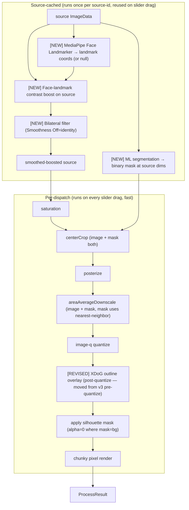
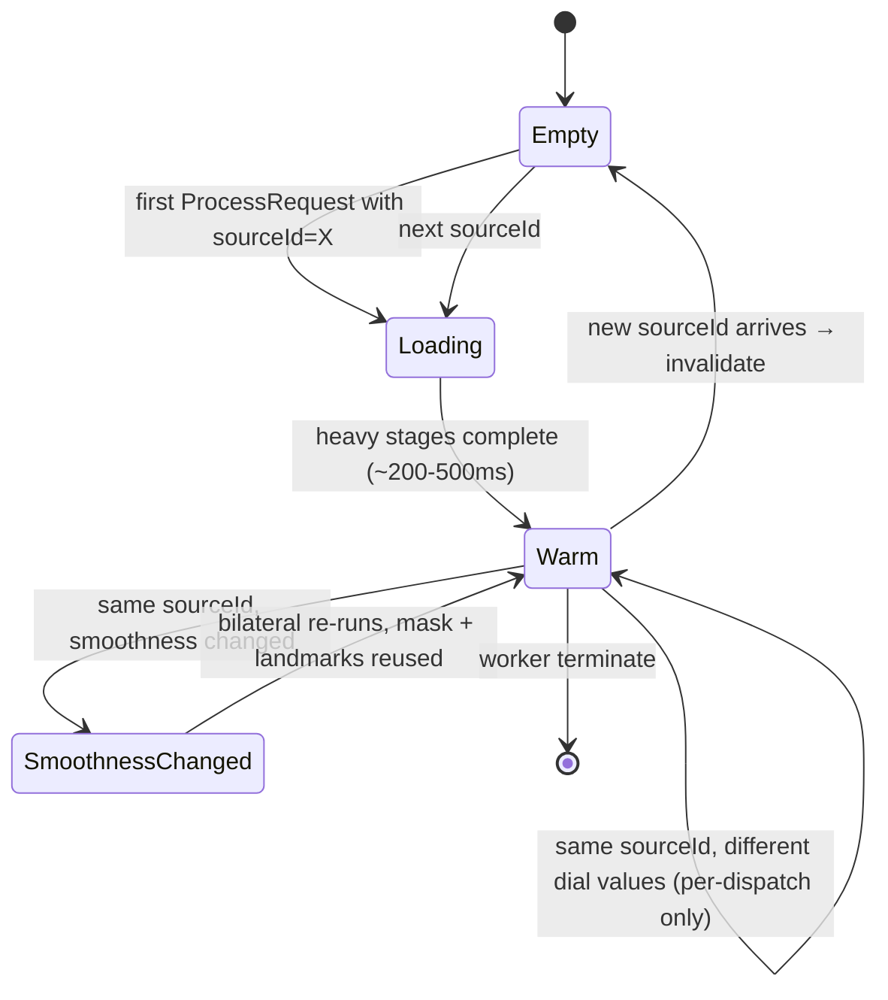

# feat: Pixel-Art Cartoon Quality (v4)

## Summary

A cohesive cartoon-quality release that lands across nine implementation units. Foundation first (ONNX Runtime Web adapter + Cache Storage layer for model files; in-worker source-cache scaffolding), then four new pipeline-stage units (bilateral pre-downscale smoothing, XDoG outline replacement applied post-quantize, ONNX U2-NetP segmentation, MediaPipe Face Landmarker + landmark-aware contrast boost), then filter-default re-tuning, ML loading-state UX, and the v4-invariant test plus bundle ceiling update. Heavy stages source-cache so slider drag stays at v3 speed after the first per-source render.

---

## Problem Frame

v3 shipped 5 stylistic filter presets but on real photographic input the output reads as muted noise rather than cartoon: Sobel outlines pick up texture noise; Wu quantization without smoothing produces low-contrast mush; naive corner-sample silhouette breaks on cluttered backgrounds; eyes / mouth / nose vanish when downscaled to ~128px. Each failure has a different root cause and a different fix. v4 replaces the broken primitives with the algorithms cartoon-stylization research has converged on (XDoG, bilateral, ML segmentation, ML face landmarks) and re-tunes filter defaults so the cartoon-leaning filters (Portrait, Units, Asset) produce the look the README promises. See origin `docs/brainstorms/2026-05-07-pixel-art-cartoon-quality-requirements.md` for the full diagnosis and the per-failure-mode rationale.

---

## Requirements

Carried verbatim from origin (R1–R15). IDs preserved for traceability.

**New pipeline stages**
- R1. **Bilateral pre-quantize smoothing.** Source-stage smoothing with single user-facing "Smoothness" knob (Off / Low / Medium / High). Off = identity (R12).
- R2. **XDoG outline transform** replaces v3's Sobel-based outline. Cleaner cartoon line work; outline applied AFTER quantize so configured color stays the output color.
- R3. **ML general-subject segmentation** for silhouette. Replaces naive corner-sample as v4 default when models load successfully; naive retained as fallback path.
- R4. **ML face-landmark detection + landmark-aware contrast boost.** When face detected, eyes/mouth/nose regions get a small contrast bump on the source before downscale.

**Filter-default re-tuning**
- R5. **Cartoon filter defaults updated.** Portrait, Units, Asset get bilateral on, XDoG outline, retuned saturation; Portrait raises to long-edge 192. Painterly filters (Art piece, Environment) stay roughly as-is.

**Caching architecture**
- R6. **Lazy model loading.** Models load on first cartoon-filter or silhouette use; cached to browser Cache Storage.
- R7. **Source-cached worker state.** Bilateral, segmentation, and landmarks cache per source. New source invalidates; same source with new resolution / palette / etc. reuses the cache.

**UX surfaces**
- R8. **Model-download progress indicator** below the StyleSelector while models load.
- R9. **First-render spinner** overlays the result pane during heavy-stage run on a new source.
- R10. **First-render visual fallback.** Degraded-mode result while ML models download; re-renders to full quality after.
- R11. **New pipeline stages exposed as Advanced controls.** SmoothnessControl (bilateral); SilhouetteControl gains a Quality toggle (Fast / Smart, default Smart); a FaceBoostToggle for landmark-aware processing.

**v3 invariant**
- R12. **v3-default invariant.** Smoothness=Off + ML disabled/unavailable + face-aware off + naive silhouette path + every other v3 control at default → byte-identical output to v3.

**Failure handling**
- R13. **Graceful degradation when ML unavailable.** Inline notice; pipeline falls back to v3-equivalent output; bilateral and XDoG (CPU-only) still run.

**Performance**
- R14. **Latency budgets.** First render with ML active: ≤ 500 ms on 2026 laptop. Per-dispatch after cache warm: ≤ 60 ms.

**Bundle**
- R15. **Bundle posture.** Model files loaded via Cache Storage on demand, NOT bundled into JS. JS chunk grows for runtime adapter; ceiling raised.

**Origin actors:** A1 (portfolio visitor), A2 (standalone visitor), A3 (game-asset producer — most consequential A3 in v4).
**Origin flows:** F1 (portfolio embed), F2 (standalone), F3 (first-time cartoon-filter use with model load), F4 (source change with ML active), F5 (model load failure / offline degradation).
**Origin acceptance examples:** AE1 (bilateral produces flat regions), AE2 (XDoG follows subject silhouettes; outline color preserved post-quantize), AE3 (ML segmentation cuts cluttered-bg sword), AE4 (faces preserve eyes/mouth at long-edge 192), AE5 (slider drag stays live after first render), AE6 (R12 byte-equality), AE7 (degraded-mode then upgrade), AE8 (offline notice + fallback).

---

## Scope Boundaries

Carried verbatim from origin's Scope Boundaries:

- Approach B (end-to-end stylization model) — explicitly rejected.
- Server-side processing.
- Custom-trained / fine-tuned models.
- Mask editing UI (paint to refine ML cutout).
- Real-time video / multi-image batch.
- Specific-style toggles ("Anime" / "Disney" / "Comic Book").
- Per-region color simplification (segment + assign per-region palette color).
- GPU / WebGPU acceleration — WASM-only first.
- Person-only segmentation models (MediaPipe Selfie Segmentation).
- Removing naive corner-sample silhouette — retained as fallback.
- Auto-detecting cartoon vs photo source content.
- Bundling models into the JS chunk.

### Deferred to Follow-Up Work

- **Higher-quality segmentation model upgrade** (BiRefNet-lite quantized at ~30–40 MB) — deferred until users complain about U2-NetP quality on cluttered/transparent objects.
- **R2 with hashed filenames for model hosting** — v4 ships with HF Hub direct as the default; migration to R2 is a configuration change in `apps/remote/src/ml/runtime.ts` once the user has Cloudflare R2 set up.
- **WebGPU fast path** — would yield ~20× speedup on segmentation per IMG.LY's reported numbers but adds a fallback chain; defer until perf is the bottleneck.
- **Mask editing UI** — only fires if v4 quality bar isn't met after shipping.

---

## Context & Research

### Relevant Code and Patterns

- **`apps/remote/src/pipeline/pixelArtWorker.ts`** — current 7-stage pipeline (composite → saturation → crop → posterize → downscale → outline → quantize → silhouette → chunky). v4 adds bilateral / segmentation / face-boost as source-cached stages and moves outline to post-quantize.
- **`apps/remote/src/pipeline/protocol.ts`** — already grew optional fields in v2/v3. v4 adds ~6 more (smoothness, silhouetteQuality, faceAwareEnabled, sourceId, plus existing fields enriched).
- **`apps/remote/src/pipeline/silhouette.ts`** — v3's naive corner-sample lives here. v4 keeps it as the fallback path; ML path lives in `apps/remote/src/ml/segmentation.ts`.
- **`apps/remote/src/pipeline/outline.ts`** — currently Sobel-based, applied pre-quantize. v4 replaces internals with XDoG and moves the worker call site to post-quantize.
- **`apps/remote/src/pipeline/saturation.ts` + `apps/remote/src/pipeline/posterize.ts`** — pattern to mirror for new pure-function stages: explicit identity short-circuit at default values for the v3-invariant contribution.
- **`apps/remote/src/components/SilhouetteControl.tsx`** — v3 component; v4 extends with a Quality toggle (Fast/Smart, default Smart).
- **`apps/remote/src/components/AdvancedControlsPanel.tsx`** — v2 disclosure pattern. v4's new controls (Smoothness, FaceBoost) slot into the same panel.
- **`apps/remote/src/exposes/PixelArtApp.tsx`** — owns all dial state. v4 grows the state shape by ~5 fields and adds source-id minting + ML-status subscription.
- **`apps/remote/src/hooks/usePixelArtPipeline.ts`** — already accepts a ProcessOptions object; v4 extends the shape and grows the worker message protocol.
- **`apps/remote/src/filters.ts`** — v3 filter catalog; v4 updates per-filter values and adds new fields (smoothness, faceAwareEnabled, silhouetteQuality).

### Institutional Learnings

- v1 caught the `bitmap.close()` zero-width bug (close zeroes dims; capture before close). v4's source-cache stores ImageData (not ImageBitmap), but the same care applies if any code path uses ImageBitmaps in the cached results.
- v3's float-equality issue on saturation drag (resolved with `Math.abs(a - b) < 1e-3` in `dialsMatchPreset`) — the same epsilon discipline applies to any new float-valued dials. Smoothness is a discrete level (off/low/medium/high), so this isn't relevant for it.
- v3's `quantize.ts` writes `alpha=255` per-pixel; works correctly only because `applyMask` runs after. v4 keeps that ordering and adds an explicit comment in `pixelArtWorker.ts` noting the dependency.

### External References

External research dispatched (`docs/brainstorms/2026-05-07-pixel-art-cartoon-quality-requirements.md` Outstanding Questions). Key findings:

- **ONNX Runtime Web** (`onnxruntime-web/wasm`, ~50–100 KB JS adapter; .wasm files served at runtime via `ort.env.wasm.wasmPaths`) is the right runtime for segmentation. Single-threaded SIMD-only for our deploy posture (Module Federation cross-origin loads break under COOP/COEP that threads require). Reference: [ONNX Runtime Web deploy docs](https://onnxruntime.ai/docs/tutorials/web/deploy.html).
- **MediaPipe Tasks** (`@mediapipe/tasks-vision`, ~3–4 MB `.task` bundle) is the right runtime for face landmarks — pre-bundled BlazeFace + 478-point mesh + blendshapes. Worker integration has historical quirks tracked at [MediaPipe issue #5527](https://github.com/google-ai-edge/mediapipe/issues/5527).
- **U2-NetP** (~4.7 MB, Apache-2.0, ONNX) is the only general-subject segmentation model in the 4–8 MB range that's commercial-safe. RMBG-1.4/2.0 are CC-BY-NC; MODNet is portrait-only; BiRefNet-lite blows the budget. Reference: [BritishWerewolf/U-2-Netp](https://huggingface.co/BritishWerewolf/U-2-Netp), [U-2-Net repo](https://github.com/xuebinqin/U-2-Net).
- **MediaPipe Face Landmarker** integrates as a single `.task` bundle ~3–4 MB. Reference: [MediaPipe Face Landmarker Web guide](https://ai.google.dev/edge/mediapipe/solutions/vision/face_landmarker/web_js).
- **Cache Storage** for model files: version cache name (`models-v1`), content-hash filenames, watch for mobile Safari's 7-day storage eviction. Reference: [MDN Storage quotas & eviction](https://developer.mozilla.org/en-US/docs/Web/API/Storage_API/Storage_quotas_and_eviction_criteria).
- **Memory growth**: ORT-Web's WASM heap only grows; reuse one session per model for the worker's lifetime. Recreate worker (don't dispose session) on context loss. Reference: [ORT memory issue #14641](https://github.com/microsoft/onnxruntime/issues/14641).
- **Real-world reference**: [@imgly/background-removal](https://github.com/imgly/background-removal-js/tree/main/packages/web) is the canonical "ORT-Web wraps a quantized segmentation model in a worker" pattern; their architecture mirrors v4's intended shape.

---

## Key Technical Decisions

- **Pipeline order in v4** (source-cached stages bracketed):
  ```
  source ImageData
    → [ML segmentation (cached) → mask at source dims]
    → [ML face-landmark detection (cached) → landmark coords]
    → [face-landmark contrast boost on source (cached)]
    → [bilateral on boosted source (cached, keyed by source-id + smoothness)]
    [per-dispatch from here:]
    → saturation
    → crop (image and mask cropped together)
    → posterize
    → downscale (image and mask both)
    → quantize
    → XDoG outline overlay (post-quantize — architectural shift from v3)
    → apply silhouette mask (alpha=0 where mask=bg)
    → chunky pixel render
    → result
  ```

- **Two ML runtimes accepted.** ONNX Runtime Web (`onnxruntime-web/wasm`) for segmentation; `@mediapipe/tasks-vision` for face landmarker. Single-runtime alternative (everything ONNX with a small face detector) considered and rejected — MediaPipe's pre-trained Face Landmarker is dramatically less integration work than rolling face detection on ORT.

- **U2-NetP for segmentation, no exceptions.** RMBG-1.4/2.0 ruled out for non-commercial license (CC-BY-NC-4.0). BiRefNet-lite quantized would be higher quality but blows the 4–8 MB budget; revisit as a "Quality: Premium" option in v5+.

- **MediaPipe Face Landmarker over standalone BlazeFace.** Standalone BlazeFace is smaller (~200 KB) but rolling our own landmark extraction adds work. Face Landmarker's `.task` bundle (~3–4 MB) gives us 478-point mesh + blendshapes for free; we use ~6 of those landmarks (eye centers, mouth corners, nose tip) but the bundle weight is identical.

- **WASM SIMD only, no threads.** Threads need cross-origin isolation (COOP/COEP), which breaks Module Federation cross-origin loading into the portfolio host. Reference: [web.dev COOP/COEP](https://web.dev/articles/coop-coep).

- **Source-cache architecture: in-worker `Map<sourceId, SourceCache>`.** Single-source LRU effectively (only one entry kept; new source-id evicts old). `SourceCache` carries `{ smoothnessKey: string, bilateralOutput: ImageData, segmentationMask: ImageData | null, landmarks: NormalizedLandmark[] | null }`. Smoothness change recomputes bilateral but doesn't invalidate segmentation/landmarks. Source change invalidates the whole entry.

- **Source-id minting**: main thread generates an opaque string (UUID v4 or counter) on every file change; passes through every ProcessRequest. Worker keys cache on this string. No content hashing — explicit invalidation by id is simpler and correct enough.

- **Model hosting**: HF Hub direct for v4 MVP (free, CORS-enabled, easy to swap later). `apps/remote/src/ml/runtime.ts` exposes a configurable base URL so migration to R2-with-hashed-filenames is a constant change. Plan documents both paths in `docs/deploy.md` (updated in U9).

- **Cache versioning strategy**: cache name is `pixelart-models-v1`; bumping to `v2` (when we change models) invalidates the entire cache. Within a version, model files use content-hash URLs so old files become unreachable. Mobile Safari's 7-day eviction is acceptable — cold re-download takes the model-load progress UI, which is fine.

- **Bilateral filter implementation**: pure-JS naive O(N·r²) bilateral — no separable approximation, no WebGL. At source resolutions ≤ 1024×1024 and radius ≤ 5, runs in ~50–150 ms (well within the 500 ms first-render budget). Smoothness levels: Off → identity, Low → (spatial-σ=1, range-σ=25), Medium → (2, 35), High → (3, 50). User-facing knob hides the σ values.

- **XDoG implementation**: Winnemöller-style XDoG. Two Gaussian blurs (σ=0.4, k·σ=0.64), difference, then `0.5·(1 + tanh(φ·(diff − ε)))` thresholding. Standard parameters: τ=0.99, ε=0.1, φ=200. Operates on luminance from the quantized image. Output is an alpha mask; overlay outline color where mask > threshold.

- **OutlineControl architecturally unchanged**, only internals swapped. The toggle / width / color picker UX is identical to v3. Width still drives dilation passes (post-XDoG-mask) for thicker lines.

- **Naive corner-sample silhouette retained** with the existing `apps/remote/src/pipeline/silhouette.ts` API. SilhouetteControl gains a Quality toggle: `Fast` uses naive corner-sample (v3 behavior, no model load); `Smart` uses ML segmentation (v4 default when model loads). When ML model fails to load, Smart silently falls back to Fast and surfaces the inline notice.

- **Face-aware boost timing**: runs AFTER bilateral, BEFORE saturation. Bilateral first because we want to smooth the source generally; then face boost reasserts feature contrast at landmark positions so it survives downscale. Cached per source-id (not per-smoothness — boost only depends on source + landmarks).

- **Worker source-cache invalidation discipline**: any change in source-id drops the cache immediately. Memory bound is one entry. Worker termination (already wired in v1's lifecycle) drops everything.

- **Bundle ceiling raises from 34 KB to 110 KB** (raw exposed chunk). Most of the growth is the ORT-Web JS adapter (~50–100 KB) plus MediaPipe Tasks JS shim plus new components. Model files NOT counted; they live in Cache Storage.

- **Tests**: pure-function tests for bilateral / XDoG / faceBoost in jsdom (mocked ImageData). ML runtime modules tested via mock factory (real inference is browser-only and surfaces in manual harness smoke). The v4-invariant test extends v3's pattern.

---

## Open Questions

### Resolved During Planning

- **ML runtime choice**: ORT-Web for segmentation + MediaPipe Tasks for face landmarker.
- **Segmentation model**: U2-NetP (Apache-2.0, ~4.7 MB, ONNX from HF).
- **Face landmark model**: MediaPipe Face Landmarker `.task` (~3–4 MB).
- **Model hosting**: HF Hub direct for v4; migration path to R2 documented.
- **Cache key strategy**: opaque source-id from main thread, not content hash.
- **Threads**: skip; SIMD-only.
- **Bilateral implementation**: pure-JS naive bilateral.
- **XDoG variant**: Winnemöller XDoG with standard parameters.
- **Outline pipeline position**: post-quantize.
- **Naive silhouette fate**: retained as fallback path, exposed as Quality: Fast.

### Deferred to Implementation

- **Exact U2-NetP input resolution and threshold**: model expects 320×320 normalized input; threshold for binary mask is typically 0.5 but may need tuning against real photos. Verify during U5 implementation against a small fixture set.
- **MediaPipe Face Landmarker `.task` source URL**: jsDelivr-hosted at a known path. Pinning to a specific version vs. latest is a U6 implementation choice.
- **Bilateral parameter tuning**: σ values per Smoothness level are starting points; final values tuned during U3 against real photo fixtures and the per-filter visual targets.
- **XDoG threshold (φ, ε)**: standard parameters are starting points; final tuning during U4 against the per-filter visual targets (Units' thick black should look right at φ=200 ε=0.1 but verify).
- **Face-boost contrast amount and radius**: starting at +20% local contrast in 16×16 px windows around each landmark. Final values tuned during U6 against face-photo fixtures.
- **Worker error code taxonomy for ML failures**: extend the existing `WorkerErrorMessage` shape (`decode_failed | invalid_input | internal_error`) with `ml_model_load_failed | ml_inference_failed`. Specific codes finalized in U1 + U5.
- **First-load progress copy**: "Loading enhanced segmentation model…" or simpler. Plan-time UX call during U8.
- **Degraded-mode notice copy**: starting from "Smart cutout unavailable — using basic background detection." Final copy during U8.
- **MediaPipe `.task` bundle integrity check**: whether to verify SRI / SHA on download. Probably not for v4 (HF/jsDelivr CDN is trusted-enough for portfolio); revisit if model-tampering becomes a concern.

---

## Output Structure

This plan adds a new `apps/remote/src/ml/` directory plus several new files in existing dirs. Expected layout after U1–U9:

```
apps/remote/src/
  ml/                                  ← NEW dir
    runtime.ts                         ← ORT-Web wrapper (U1)
    modelCache.ts                      ← Cache Storage helper (U1)
    segmentation.ts                    ← U2-NetP integration (U5)
    faceLandmarks.ts                   ← MediaPipe integration (U6)
    types.ts                           ← shared ML types (U1)
  pipeline/
    bilateral.ts                       ← NEW (U3)
    xdog.ts                            ← NEW (U4)
    faceBoost.ts                       ← NEW (U6)
    pixelArtWorker.ts                  ← MODIFY (every unit)
    protocol.ts                        ← MODIFY (every unit)
    outline.ts                         ← MODIFY (U4 — XDoG internals)
    silhouette.ts                      ← MODIFY (U5 — adds ML path)
    sourceCache.ts                     ← NEW (U2 — worker-side cache)
    [existing v3 files unchanged]
  components/
    SmoothnessControl.tsx              ← NEW (U3)
    FaceBoostToggle.tsx                ← NEW (U6)
    ModelLoadIndicator.tsx             ← NEW (U8)
    FirstRenderSpinner.tsx             ← NEW (U8)
    DegradedModeNotice.tsx             ← NEW (U8)
    SilhouetteControl.tsx              ← MODIFY (U5 — Quality toggle)
    [existing v3 files unchanged]
  exposes/
    PixelArtApp.tsx                    ← MODIFY (every unit)
  hooks/
    usePixelArtPipeline.ts             ← MODIFY (every unit)
  filters.ts                           ← MODIFY (U7)

apps/remote/tests/
  ml/
    modelCache.test.ts                 ← NEW (U1)
    segmentation.test.ts               ← NEW (U5, mocked runtime)
    faceLandmarks.test.ts              ← NEW (U6, mocked runtime)
  pipeline/
    bilateral.test.ts                  ← NEW (U3)
    xdog.test.ts                       ← NEW (U4)
    faceBoost.test.ts                  ← NEW (U6)
    sourceCache.test.ts                ← NEW (U2)
    v1-invariant.test.ts               ← MODIFY (U9 → v4 invariant extension)
  components/
    SmoothnessControl.test.tsx         ← NEW (U3)
    FaceBoostToggle.test.tsx           ← NEW (U6)
    ModelLoadIndicator.test.tsx        ← NEW (U8)
    DegradedModeNotice.test.tsx        ← NEW (U8)
    SilhouetteControl.test.tsx         ← MODIFY (U5 — Quality toggle)

apps/remote/scripts/
  verify-build.sh                      ← MODIFY (U9 — ceiling raise + ML-not-bundled check)

docs/
  deploy.md                            ← MODIFY (U9 — model hosting recipe + R2 migration path)
```

Implementer may adjust as implementation reveals a better layout; per-unit `**Files:**` lists remain authoritative.

---

## High-Level Technical Design

> *This illustrates the intended approach and is directional guidance for review, not implementation specification. The implementing agent should treat it as context, not code to reproduce.*

### Pipeline order



### Worker source-cache lifecycle



### Component tree (v4 changes from v3 in bold)

```
PixelArtApp
├── DropZone (v1)
├── StyleSelector (v3)                          ← unchanged externally
├── ModelLoadIndicator (NEW, conditional)       ← U8
├── DegradedModeNotice (NEW, conditional)       ← U8
├── ResolutionSlider (v1)
├── <details> "Advanced"
│   ├── SaturationSlider (v2)
│   ├── AspectRatioSelect (v2)
│   ├── PaletteModeControl (v2)
│   ├── BrandColorsTextarea (v2)
│   ├── PaletteSizeControl (v3)
│   ├── OutlineControl (v3, XDoG internals via U4)
│   ├── PosterizationControl (v3)
│   ├── SilhouetteControl (v3, **Quality toggle added in U5**)
│   ├── ChunkyPixelsControl (v3)
│   ├── **SmoothnessControl (NEW, U3)**
│   └── **FaceBoostToggle (NEW, U6)**
├── SideBySidePreview (v1)
│   └── **FirstRenderSpinner (NEW overlay, U8)**
└── Download PNG button (v3)
```

---

## Implementation Units

### U1. ML runtime adapter + model file Cache Storage layer

**Goal:** Foundation for v4's ML stages. Create the abstraction layer for ONNX Runtime Web (lazy import, env config, session creation) and the Cache Storage helper for model file fetch + cache. No model loaded yet.

**Requirements:** R6, R15

**Dependencies:** None

**Files:**
- Create: `apps/remote/src/ml/runtime.ts` (ORT-Web wrapper: lazy `import()`, `ort.env.wasm.wasmPaths` config, `ort.env.wasm.numThreads = 1`, single-session-per-model accessor)
- Create: `apps/remote/src/ml/modelCache.ts` (Cache Storage helper: `fetchModel(url)` opens `pixelart-models-v1` cache, looks up by URL, fetches + cache.put on miss, falls back to in-memory ArrayBuffer on QuotaExceededError)
- Create: `apps/remote/src/ml/types.ts` (shared types: `ModelDescriptor`, `InferenceSessionWrapper`, `MLRuntimeError`)
- Modify: `apps/remote/package.json` (add `onnxruntime-web` as a runtime dependency)
- Test: `apps/remote/tests/ml/modelCache.test.ts`

**Approach:**
- `runtime.ts` exports `getOrtSession(modelUrl: string): Promise<InferenceSessionWrapper>` — lazy-imports `onnxruntime-web/wasm` (NOT the full `onnxruntime-web` — tree-shakes WebGPU/WebGL paths), sets `wasmPaths` to a configurable CDN URL, sets `numThreads = 1`, calls `ort.InferenceSession.create()` with the cached ArrayBuffer from `modelCache.fetchModel()`.
- **Corrupt-cache self-heal**: if `ort.InferenceSession.create()` throws on a cached ArrayBuffer (corrupt or truncated entry from a prior partial download or platform cache fault), `runtime.ts` calls `modelCache.evictModel(modelUrl)` to delete the cache entry, then retries `fetchModel` + session creation exactly once. Second failure surfaces a typed `MLRuntimeError` and the user lands in degraded mode for that session — but the next page load starts clean. Without this self-heal, a corrupt cache entry permanently degrades the user until a deploy-time `pixelart-models-v1 → v2` cache version bump.
- After creating the session, runs ONE warmup inference on a zero tensor of the model's input shape — drops first real call from ~200–400 ms to ~30–80 ms.
- `modelCache.ts`: `caches.open('pixelart-models-v1')` on demand, `cache.match(request)` for lookup, `fetch(url)` + body fully read into ArrayBuffer + `cache.put(request, new Response(buffer))` on miss. **Cache write happens AFTER the body is fully read** — avoids writing a partial response to cache if the network drops mid-stream. Catches `QuotaExceededError` and returns the fetched ArrayBuffer without caching (still works, just no persistent cache). Exports `evictModel(modelUrl)` for the self-heal path.
- Cleanup: a `purgeOldCaches()` helper deletes any cache name not in the current allow-list (`['pixelart-models-v1']`). Runs once on first model load.

**Patterns to follow:**
- v1's `apps/remote/src/pipeline/saturation.ts` for the lazy + identity-short-circuit ergonomics — same shape: a thin façade that does nothing on default and only fires on demand.
- IMG.LY's [@imgly/background-removal-js web package](https://github.com/imgly/background-removal-js/tree/main/packages/web) for canonical ORT-Web-in-worker structure.

**Test scenarios:**
- *Happy path (modelCache)*: first fetch with cache miss calls `fetch()` + `cache.put()`; second fetch with cache hit returns cached response without calling `fetch()`.
- *Edge case (modelCache)*: `QuotaExceededError` during `cache.put` is caught; the ArrayBuffer is still returned; subsequent fetches re-download.
- *Edge case (modelCache)*: `purgeOldCaches()` deletes `pixelart-models-old` and preserves `pixelart-models-v1`.
- *Error path (modelCache)*: network error during fetch surfaces a typed `MLRuntimeError` (not a generic Error).
- *Error path (modelCache)*: opaque response (CORS-blocked) surfaces a typed error rather than caching a useless opaque blob.
- *Test expectation: none for `runtime.ts`* — the ORT runtime is browser-only; integration with real ORT is exercised by U5/U6 manually in the harness. Mocked-runtime tests live in those units' test files.

**Verification:**
- `pnpm test` passes the new modelCache test suite under jsdom.
- Bundle ceiling check: this unit alone shouldn't push the ceiling past v3's 34 KB by much (no model loaded; lazy import; runtime.ts itself is tiny).

---

### U2. Source-cache scaffolding in worker

**Goal:** Add per-source-id in-worker state and the protocol field that drives it. No consumers yet — U3, U5, U6 will populate cache entries.

**Requirements:** R7

**Dependencies:** None

**Files:**
- Create: `apps/remote/src/pipeline/sourceCache.ts` (`SourceCache` class or simple Map wrapper; `get(sourceId)`, `getOrCompute(sourceId, key, computeFn)`, `invalidate(sourceId)`)
- Modify: `apps/remote/src/pipeline/protocol.ts` (add `sourceId: string` field to `ProcessRequest`)
- Modify: `apps/remote/src/pipeline/pixelArtWorker.ts` (instantiate cache; call `invalidate` on new sourceId; pass cache through to handlers)
- Modify: `apps/remote/src/exposes/PixelArtApp.tsx` (mint a new sourceId via `crypto.randomUUID()` when sourceFile changes; pass through process options)
- Modify: `apps/remote/src/hooks/usePixelArtPipeline.ts` (forward sourceId in ProcessOptions)
- Test: `apps/remote/tests/pipeline/sourceCache.test.ts`

**Approach:**
- `SourceCache` is single-entry — only one sourceId's cache lives at a time. New sourceId evicts old. Memory bound is one entry.
- Cache value is a **typed struct** matching the shape documented in Key Technical Decisions: `{ smoothnessKey: string, bilateralOutput: ImageData | null, segmentationMask: ImageData | null, landmarks: NormalizedLandmark[] | null }`. Three known consumers (U3 bilateral, U5 segmentation, U6 landmarks) write to the three corresponding slots. The generic `Record<string, unknown>` shape is rejected — it does not earn its complexity for the known consumer set, loses type safety, and buries invalidation rules across each caller's key convention.
- API: `get(sourceId): SourceCache | null`, `getOrInit(sourceId): SourceCache` (returns the active entry, evicting the previous if sourceId differs), `invalidate(sourceId)`. Callers read/write the typed slots directly: `cache.getOrInit(sourceId).bilateralOutput = result`. Bilateral consumers compare `smoothnessKey` to decide reuse vs recompute.
- The `sourceId` is opaque to the worker — it's just an equality-checkable string. No content hashing.
- Main thread mints sourceId on every file change (in the `useEffect` that handles file replacement). All ProcessRequests for that file carry the same id; new file → new id.

**Patterns to follow:**
- `apps/remote/src/hooks/usePixelArtPipeline.ts` for the "options object grows additively" pattern — adding `sourceId` to `ProcessOptions` mirrors how v2 added `saturation` / `aspectRatio`.

**Test scenarios:**
- *Happy path*: `getOrCompute(id, 'bilateral:off', fn)` calls `fn` once, returns its value; second call with same args returns cached without calling `fn`.
- *Happy path*: different keys for the same sourceId both cache independently.
- *Edge case*: new sourceId invalidates old cache; first call after invalidation calls `fn`.
- *Edge case*: `invalidate(sourceId)` for an unknown id is a no-op.
- *Edge case*: only one sourceId's cache is held at a time; switching sourceIds repeatedly doesn't grow memory.
- *Integration*: worker handler loop with two consecutive ProcessRequests with the same sourceId reuses cache; with different sourceIds runs fresh.

**Verification:**
- Test suite passes.
- Worker still produces v3-equivalent output with no consumers using the cache yet (R12 invariant trivially holds because no new stages are firing).

---

### U3. Bilateral filter pipeline stage + Smoothness control

**Goal:** Add the cartoon-smoothing stage and its UI control. Source-cached. Off = identity.

**Requirements:** R1, R5, R7, R12

**Dependencies:** U2 (uses source cache)

**Files:**
- Create: `apps/remote/src/pipeline/bilateral.ts`
- Create: `apps/remote/src/components/SmoothnessControl.tsx`
- Modify: `apps/remote/src/pipeline/pixelArtWorker.ts` (insert bilateral as source-cached stage between source and saturation)
- Modify: `apps/remote/src/pipeline/protocol.ts` (add `smoothness?: 'off' | 'low' | 'medium' | 'high'`)
- Modify: `apps/remote/src/exposes/PixelArtApp.tsx` (state + threading)
- Modify: `apps/remote/src/hooks/usePixelArtPipeline.ts` (forward smoothness)
- Test: `apps/remote/tests/pipeline/bilateral.test.ts`, `apps/remote/tests/components/SmoothnessControl.test.tsx`

**Approach:**
- `bilateralFilter(image: ImageData, smoothness: 'off' | 'low' | 'medium' | 'high'): ImageData`. `'off'` short-circuits to identity (return input — same reference).
- Naive O(N·r²) bilateral. Spatial and range Gaussians per pixel: `out_p = sum over q in window of [I_q · g_spatial(p−q) · g_range(I_p − I_q)] / normalization`.
- Smoothness levels map to (spatial-σ, range-σ): off → identity; low → (1.0, 25); medium → (2.0, 35); high → (3.0, 50).
- Window radius is `ceil(2·spatial-σ)` (covers ~95% of the spatial kernel). For high smoothness that's a 7×7 window per pixel.
- On a typical 1024×768 source: low ~50 ms, medium ~100 ms, high ~200 ms (M-class laptop). Within the source-stage budget.
- Worker call site: `cache.getOrCompute(sourceId, 'bilateral:' + smoothness, () => bilateralFilter(source, smoothness))`. Smoothness change recomputes; source change invalidates whole cache.
- `SmoothnessControl`: dropdown with 4 options ("Off (default)", "Low", "Medium", "High"). Disabled when no image loaded (matches v2's policy).

**Patterns to follow:**
- `apps/remote/src/pipeline/saturation.ts` for the identity short-circuit pattern.
- `apps/remote/src/components/ChunkyPixelsControl.tsx` for the labeled-default-option dropdown pattern.

**Test scenarios:**
- *Happy path (R12)*: `bilateralFilter(image, 'off')` returns the input ImageData unchanged (same reference, byte-identical).
- *Happy path*: solid-color input is unchanged at every smoothness level (variance = 0; bilateral is a no-op on flat regions).
- *Happy path*: input with sharp edge between two flat regions (e.g., black/white halves) preserves the edge at all smoothness levels — pixels at the boundary stay near 0 or 255, not midway.
- *Happy path*: noisy input (random per-pixel jitter) at smoothness=high has lower per-pixel variance than the input (smoothing happened).
- *Happy path*: alpha channel is preserved untouched at every smoothness level.
- *Edge case*: 1×1 input at any smoothness returns input unchanged.
- *Edge case*: 3×3 input at smoothness=high doesn't crash (window may exceed input dims; clamp at edges).
- *Component happy path (SmoothnessControl)*: default option label includes "(default)" so the no-op state is self-describing.
- *Component happy path*: emits new smoothness value on change.
- *Component edge case*: disabled when prop is set; option list includes all four values.
- *Integration (worker)*: two ProcessRequests with same sourceId + same smoothness reuse the cached bilateral output; second smoothness change recomputes; new sourceId invalidates.

**Verification:**
- Test suite passes.
- Manual harness smoke: drop a portrait, set Smoothness=Medium with no other changes, observe that flat regions (skin, background) become flatter while edges (eyes, nostrils, lip line) stay sharp.

---

### U4. XDoG outline replacement (post-quantize position)

**Goal:** Replace Sobel internals in `outline.ts` with XDoG; move outline call site in worker from pre-quantize to post-quantize so configured outline color stays the output color.

**Requirements:** R2, R5, R12

**Dependencies:** None (independent of U1–U3)

**Files:**
- Create: `apps/remote/src/pipeline/xdog.ts` (Winnemöller XDoG; pure function returning binary edge mask)
- Modify: `apps/remote/src/pipeline/outline.ts` (internals swap: Sobel → XDoG; same external API; identity short-circuit unchanged)
- Modify: `apps/remote/src/pipeline/pixelArtWorker.ts` (move outline call from pre-quantize to post-quantize)
- Test: `apps/remote/tests/pipeline/xdog.test.ts`, modify `apps/remote/tests/pipeline/outline.test.ts` (assertions for XDoG-vs-Sobel behavior)

**Approach:**
- `xdog(luminance: Float32Array, w: number, h: number, params): Uint8Array` returns a binary edge mask.
- XDoG math: two Gaussian blurs with `σ` and `k·σ`, take the weighted difference `(1+τ)·blurσ − τ·blurkσ`, threshold via `0.5 · (1 + tanh(φ · (diff − ε)))`, binarize.
- Standard parameters: σ=0.4, k=1.6, τ=0.99, ε=0.1, φ=200. These produce the "thick subject silhouette + thin interior detail" cartoon look.
- `outline.ts` continues to expose `applyOutline(image, options)` with the same `OutlineOptions` shape as v3. enabled=false short-circuits to identity (same reference). Width controls dilation passes after XDoG (same dilation logic v3 had).
- Worker pipeline reorder: outline call moves from `pixelArtWorker.ts` step 4b (post-downscale, pre-quantize) to a new step 7 (post-quantize, pre-silhouette-mask). This is the architectural shift documented in origin's R2 + Key Decisions.
- Color overlay: where XDoG mask is true after dilation, replace pixel with the configured outline color. Quantize has already run; outline color stays exact.

**Patterns to follow:**
- `apps/remote/src/pipeline/saturation.ts` for identity short-circuit.
- v3's `outline.ts` for the dilation logic — keep the dilation pass, swap only the edge detection.

**Test scenarios:**
- *Happy path (xdog)*: solid-color input produces a mask with no edges (all zeros).
- *Happy path (xdog)*: high-contrast subject (e.g., a dark square on light background) produces a clean rectangle outline, NOT the Sobel-style halo around every gradient.
- *Happy path (xdog)*: noisy textured input produces fewer mask pixels than Sobel would (the standard XDoG-vs-Sobel quality difference; not a precise count, but a `xdogMaskCount < sobelMaskCount + threshold` assertion against a fixed fixture).
- *Happy path (outline)*: width=2 produces a thicker output than width=1 (count of outline-colored pixels is strictly greater).
- *Happy path (outline)*: outline color in the input matches exactly in the output (no palette absorption — verifies the post-quantize position).
- *Edge case (outline R12)*: enabled=false returns input unchanged (same reference).
- *Edge case (xdog)*: 3×3 input doesn't crash (Gaussian blur padding handles small inputs).
- *Integration*: worker pipeline with outline.enabled=true on a fixture image produces output with the configured outline color present in the result; with outline.enabled=false produces v3-byte-identical output.

**Verification:**
- Test suite passes.
- Manual harness smoke: drop a portrait, enable outline thick black, verify lines follow eye sockets / mouth / nose bridge / jaw and DON'T trace skin texture.

---

### U5. ML segmentation integration (U2-NetP)

**Goal:** Lazy-load U2-NetP on first Smart-quality silhouette use; produce a binary alpha mask via inference; replace naive corner-sample as the v4 default; retain naive as the Fast quality fallback.

**Requirements:** R3, R5, R6, R7, R8, R10, R13

**Dependencies:** U1 (uses ml/runtime), U2 (caches mask in source cache)

**Files:**
- Create: `apps/remote/src/ml/segmentation.ts` (loads U2-NetP, runs inference, returns binary mask)
- Modify: `apps/remote/src/pipeline/silhouette.ts` (no change to existing API; the ML path lives in `apps/remote/src/ml/segmentation.ts` and the worker calls one or the other based on quality)
- Modify: `apps/remote/src/pipeline/pixelArtWorker.ts` (route silhouette: Smart → call ML segmentation when model loaded; Fast → naive corner-sample (v3 path); on ML load failure, fall back to Fast + emit ml-error message)
- Modify: `apps/remote/src/pipeline/protocol.ts` (add `silhouetteQuality?: 'fast' | 'smart'`; add outbound `ml-status` and `ml-error` message types)
- Modify: `apps/remote/src/components/SilhouetteControl.tsx` (add Quality toggle with two radio buttons: Fast / Smart, default Smart)
- Modify: `apps/remote/src/exposes/PixelArtApp.tsx` (state + threading; subscribe to ml-status/ml-error worker messages)
- Modify: `apps/remote/src/hooks/usePixelArtPipeline.ts` (forward silhouetteQuality; surface ML status in PipelineState)
- Test: `apps/remote/tests/ml/segmentation.test.ts` (mocked InferenceSession), `apps/remote/tests/components/SilhouetteControl.test.tsx` (extend with Quality toggle scenarios)

**Approach:**
- `segmentation.ts` exports `runSegmentation(source: ImageData): Promise<ImageData>` — returns a binary mask (alpha=0 background, alpha=255 foreground).
- Steps inside `runSegmentation`:
  1. Get the ORT session for U2-NetP via `getOrtSession()` from U1. Lazy-loads on first call.
  2. Resize source to 320×320 (U2-NetP's input shape) using a temporary OffscreenCanvas. Normalize RGB to model's expected mean/std.
  3. Run inference (`session.run({ input: tensor })`).
  4. Post-process: threshold output probability map at 0.5 → binary, upscale back to source dims (nearest-neighbor — preserves binary semantics).
  5. Return as ImageData with alpha encoding the mask (R/G/B unused).
- Worker integration: when `silhouetteEnabled` AND `silhouetteQuality === 'smart'`, try ML path; on success cache mask in source-cache; on `MLRuntimeError`, fall back to naive corner-sample AND emit `ml-error` outbound message so main thread can surface the degraded notice.
- `silhouette.ts` `apply` step is unchanged — it just consumes whichever mask was built.
- SilhouetteControl: when ML model is loaded successfully, both radio options visible. When ML failed, `Smart` option is disabled with a tooltip ("Loading enhanced cutout failed — using basic detection") and the radio falls back to Fast.

**Patterns to follow:**
- v2's `apps/remote/src/pipeline/quantize.ts` `image-q` integration for "wrap a heavy-ish library" structure.
- v3's `apps/remote/src/components/SilhouetteControl.tsx` for the existing component shape.
- IMG.LY's [background-removal-js worker integration](https://github.com/imgly/background-removal-js/tree/main/packages/web) as the canonical reference.

**Test scenarios:**
- *Happy path (segmentation, mocked runtime)*: passing a fixture ImageData through `runSegmentation` with a stubbed `InferenceSession.run` that returns a known probability map produces the expected binary mask after threshold + upscale.
- *Edge case (segmentation, mocked)*: probability map all-zeros produces an all-zero mask (everything is background); all-ones produces all-foreground.
- *Edge case (segmentation, mocked)*: source dims are preserved end-to-end (mask matches source dims exactly, not 320×320).
- *Error path (segmentation, mocked)*: `InferenceSession.create` rejects → typed `MLRuntimeError` propagates; mask returns null.
- *Error path (worker)*: ML segmentation throws → worker falls back to naive corner-sample for that source AND posts `ml-error` outbound message exactly once per session.
- *Component happy path (SilhouetteControl)*: Quality toggle defaults to Smart; switching to Fast emits the new value; both options keyboard-navigable.
- *Component edge case*: when ML model failed to load, the Smart option appears disabled with descriptive title; selecting it has no effect.
- *Integration (Covers AE3)*: a fixture photo with a clearly-defined foreground subject against a busy background — when ML segmentation runs (mocked to return a known good mask), the resulting PNG carries alpha=0 on background pixels and alpha=255 on subject pixels.
- *Integration (Covers AE7)*: pipeline with sourceFile change + Style=Asset; first dispatch (model not yet loaded) returns naive-quality result; after model load completes, next dispatch returns ML-quality result.

**Verification:**
- Test suite passes.
- Manual harness smoke: drop a sword photographed against a cluttered desk, pick Asset filter, observe that ML cutout follows the sword silhouette (not the desk's corners). Then disconnect network, reload, drop again, observe naive-quality fallback + degraded-mode notice.

---

### U6. ML face landmarker + landmark-aware contrast boost

**Goal:** Lazy-load MediaPipe Face Landmarker; detect faces; when landmarks found, apply a contrast boost at eye/mouth/nose regions on the source before bilateral and downscale, so features survive at low resolution.

**Requirements:** R4, R5, R7, R8, R12

**Dependencies:** U2 (caches landmarks in source cache; faceBoost stage runs after bilateral)

**Files:**
- Create: `apps/remote/src/ml/faceLandmarks.ts` (MediaPipe Tasks Face Landmarker integration; lazy load `.task` bundle from jsDelivr; expose `detectLandmarks(source: ImageData): Promise<NormalizedLandmark[] | null>`)
- Create: `apps/remote/src/pipeline/faceBoost.ts` (`applyFaceBoost(image: ImageData, landmarks: NormalizedLandmark[] | null, enabled: boolean): ImageData`; pure function; identity at !enabled or null landmarks)
- Create: `apps/remote/src/components/FaceBoostToggle.tsx`
- Modify: `apps/remote/src/pipeline/pixelArtWorker.ts` (insert face-landmarks (cached) and faceBoost (cached, after bilateral) as source-cached stages)
- Modify: `apps/remote/src/pipeline/protocol.ts` (add `faceAwareEnabled?: boolean`)
- Modify: `apps/remote/src/exposes/PixelArtApp.tsx` (state + threading)
- Modify: `apps/remote/src/hooks/usePixelArtPipeline.ts` (forward faceAwareEnabled)
- Modify: `apps/remote/package.json` (add `@mediapipe/tasks-vision` dependency)
- Test: `apps/remote/tests/ml/faceLandmarks.test.ts` (mocked Face Landmarker), `apps/remote/tests/pipeline/faceBoost.test.ts`, `apps/remote/tests/components/FaceBoostToggle.test.tsx`

**Approach:**
- `faceLandmarks.ts` exports `detectLandmarks(source)`. First call lazy-imports `@mediapipe/tasks-vision`, creates a `FaceLandmarker` from a `.task` URL (jsDelivr-hosted MediaPipe model assets; URL configurable via env or runtime constant). Subsequent calls reuse the loaded landmarker.
- Returns `NormalizedLandmark[] | null`. null = no face detected (which is a valid outcome — non-face sources skip the boost). The landmarker's confidence threshold is set to 0.5; below that → null. Also: an empty `faceLandmarks: []` from MediaPipe's result shape is normalized to null at this layer (not surfaced as an empty array). A single test scenario asserts both edge cases return null, not the array.
- `faceBoost.ts` exports `applyFaceBoost(image, landmarks, enabled)`. enabled=false OR landmarks=null short-circuits to identity (same reference). When firing: for each of {left eye, right eye, mouth corners, nose tip}, compute a 16×16 px window (roughly proportional to image size; cap at image dims), apply +20% local contrast (linear contrast around the local mean) inside the window. Boundaries softened with a Gaussian falloff so the boost doesn't show as hard rectangles.
- **Worker routing R12 gate (load-bearing for invariant correctness)**: the worker MUST skip the call to `detectLandmarks` entirely when `faceAwareEnabled === false`. Mirroring U5's silhouette gating (`silhouetteEnabled === true && silhouetteQuality === 'smart'`), face-landmark detection is gated on `faceAwareEnabled === true`. Without this gate, `detectLandmarks` would lazy-load the MediaPipe `.task` (~3-4 MB) on every new source-id even on the R12-default path (`faceAwareEnabled=false`), violating both R12 ("ML disabled/unavailable produces v3-byte-identical output") and R6 (lazy load on first cartoon-filter or silhouette use). The cache slot for landmarks stays `null` until `faceAwareEnabled` is `true`. faceBoost short-circuits naturally on `null`.
- Pipeline order: face boost runs AFTER bilateral (still source-cached), BEFORE saturation (the first per-dispatch stage). Bilateral smooths the source generally; face boost reasserts feature contrast at landmark positions; both are source-cached.
- FaceBoostToggle: simple checkbox, "Boost facial features" label. Disabled when no image loaded. Auto-disabled with tooltip when face landmarker fails to load. Default off in v3 invariant; default on in Portrait filter (set in U7).

**Patterns to follow:**
- v3's `apps/remote/src/components/SaturationSlider.tsx` for control-with-disabled state shape.
- IMG.LY's [pattern for combining segmentation + landmark-aware processing](https://github.com/imgly/background-removal-js/) — closest open-source reference (though they don't ship the exact combo).
- [MediaPipe Face Landmarker Web guide](https://ai.google.dev/edge/mediapipe/solutions/vision/face_landmarker/web_js).

**Test scenarios:**
- *Happy path (faceBoost R12)*: enabled=false returns input unchanged (same reference).
- *Happy path (faceBoost)*: landmarks=null returns input unchanged (no face → no boost).
- *Happy path (faceBoost)*: with landmarks, the local variance in each 16×16 window AROUND a landmark is greater than in the input (contrast was added).
- *Happy path (faceBoost)*: pixels far from any landmark are unchanged (boost is local).
- *Edge case (faceBoost)*: landmarks at image corners (boost windows extend off-image) don't crash; boost clips to image bounds.
- *Edge case (faceBoost)*: alpha channel preserved.
- *Happy path (faceLandmarks, mocked)*: source with a face fixture (mocked landmarker returns 6 known landmark coords) returns those coords.
- *Happy path (faceLandmarks, mocked)*: source with no face (mocked returns empty array) returns null.
- *Error path (faceLandmarks)*: model load failure surfaces typed `MLRuntimeError`; worker catches and skips face-boost (faceBoost short-circuits at null landmarks).
- *Component happy path (FaceBoostToggle)*: emits true/false on change.
- *Component edge case*: disabled when prop is set; tooltip shows when ML unavailable.
- *Integration (Covers AE4)*: pipeline with faceAwareEnabled=true on a face fixture (mocked landmarks) produces output where eye-region pixels have higher contrast variance than without faceBoost. Operationally tested as: with-boost variance > without-boost variance in measured eye windows.

**Verification:**
- Test suite passes.
- Manual harness smoke: drop a portrait, pick Portrait filter (faceAwareEnabled=true via U7), observe that eyes / mouth / nose are visible and identifiable in the 192-px output. Compare side-by-side with v3's same-source-same-resolution output (where eyes vanish).

---

### U7. Filter-default re-tuning + face-aware wiring

**Goal:** Update `filters.ts` for v4. Add new fields to `FilterPreset`. Re-tune cartoon-filter values. Portrait raises to 192.

**Requirements:** R5

**Dependencies:** U3, U4, U5, U6 (filter values reference all new fields)

**Files:**
- Modify: `apps/remote/src/filters.ts` (extend `FilterPreset` with `smoothness`, `faceAwareEnabled`, `silhouetteQuality`; re-tune per-filter values)
- Modify: `apps/remote/tests/filters.test.ts` (assertions for new fields)
- Modify: `apps/remote/src/exposes/PixelArtApp.tsx` (applyFilter handler sets the new state fields; modified-state detection extends `dialsMatchPreset` to compare new fields)

**Approach:**
- `FilterPreset` grows three fields: `smoothness: 'off' | 'low' | 'medium' | 'high'`, `faceAwareEnabled: boolean`, `silhouetteQuality: 'fast' | 'smart'`.
- Per-filter v4 defaults:

  | Filter | smoothness | faceAware | silQuality | other changes from v3 |
  |---|---|---|---|---|
  | Custom (default) | off | false | fast | none — v3 invariant baseline |
  | Art piece | off | false | fast | unchanged (painterly, no smoothing) |
  | Portrait | medium | **true** | fast | **resolution → 192**; outline thin black; posterize 6 |
  | Units | medium | false | fast | outline thick black; posterize 4; chunky 2 (v3 unchanged) |
  | Asset | low | false | **smart** | outline thick black; posterize 4; **silhouetteQuality smart** (default ML when available); resolution unchanged 48 |
  | Environment | off | false | fast | unchanged (painterly) |

- `dialsMatchPreset` updated to check the three new fields with the appropriate equality semantics (string equality for smoothness / silhouetteQuality; strict equality for faceAwareEnabled boolean).

**Patterns to follow:**
- v3's `apps/remote/src/filters.ts` for the catalog shape and existing per-filter values.

**Test scenarios:**
- *Happy path*: every v4 filter has values for all v4 dial fields (no missing keys after the schema extension).
- *Happy path (Covers AE2)*: applying Asset filter sets silhouetteQuality=smart; result respects the change.
- *Happy path (Covers AE4)*: applying Portrait filter sets resolution=192 and faceAwareEnabled=true.
- *Happy path*: Custom (the v3 invariant baseline) keeps smoothness=off, faceAwareEnabled=false, silhouetteQuality=fast.
- *Edge case (dialsMatchPreset)*: changing only smoothness flips activeStyle to "modified".
- *Edge case (dialsMatchPreset)*: changing faceAwareEnabled boolean flips to "modified".
- *Edge case (dialsMatchPreset)*: changing silhouetteQuality flips to "modified".
- *Integration (Covers AE5)*: drop image → pick Asset → drop second image → second result still uses Asset preset (Style persists; silhouetteQuality stays smart).

**Verification:**
- Test suite passes.
- Manual harness smoke: each filter's defaults produce visibly distinct output. Portrait shows recognizable face; Asset shows transparent-bg cutout (when ML model loads); Units shows cartoon outlines + chunky pixels; Environment / Art piece preserve gradient.

---

### U8. Model-load progress UX + first-render spinner + degraded-mode notice

**Goal:** Surface ML loading states to the user. Three small components, plus worker→main-thread protocol additions.

**Requirements:** R8, R9, R10, R13

**Dependencies:** U1, U5, U6 (ML stages emit status events)

**Files:**
- Create: `apps/remote/src/components/ModelLoadIndicator.tsx`
- Create: `apps/remote/src/components/FirstRenderSpinner.tsx`
- Create: `apps/remote/src/components/DegradedModeNotice.tsx`
- Modify: `apps/remote/src/pipeline/protocol.ts` (add outbound message types: `ml-status` with `{ stage, phase: 'loading' | 'ready' | 'failed' }`, `first-render-start` with `{ sourceId }`, `first-render-end` with `{ sourceId }`)
- Modify: `apps/remote/src/pipeline/pixelArtWorker.ts` (emit status events: ml-status when models start/finish loading, first-render-start/end around heavy first-render)
- Modify: `apps/remote/src/exposes/PixelArtApp.tsx` (subscribe to status events; drive indicator visibility)
- Modify: `apps/remote/src/hooks/usePixelArtPipeline.ts` (extend PipelineState with mlStatus + firstRenderActive)
- Test: `apps/remote/tests/components/ModelLoadIndicator.test.tsx`, `apps/remote/tests/components/DegradedModeNotice.test.tsx`, `apps/remote/tests/components/FirstRenderSpinner.test.tsx`

**Approach:**
- `ModelLoadIndicator`: shows below the StyleSelector when `mlStatus === 'loading'`. Compact text + indeterminate progress bar: "Loading enhanced features…" Disappears when status transitions to 'ready'.
- `FirstRenderSpinner`: overlay on the result pane during heavy first-render of a new source. Centered spinner + caption "Processing image…". Visibility tied to `firstRenderActive` state.
- `DegradedModeNotice`: inline notice below StyleSelector when `mlStatus === 'failed'`. Single line of muted text + dismiss button: "Smart cutout unavailable — using basic background detection."
- Worker emits status messages on lifecycle events. Main thread's message handler routes to PipelineState.
- Polite live region: ModelLoadIndicator and DegradedModeNotice both use `aria-live="polite"` so screen readers announce state changes.

**Patterns to follow:**
- v1's `apps/remote/src/components/SideBySidePreview.tsx` for the result-pane overlay pattern.
- v3's StyleSelector "(was: X)" indicator with `aria-live` for the polite-announce pattern.

**Test scenarios:**
- *Happy path (ModelLoadIndicator)*: renders only when `mlStatus === 'loading'`.
- *Happy path (DegradedModeNotice)*: renders only when `mlStatus === 'failed'`; dismiss button hides it; remains hidden until next failure.
- *Happy path (FirstRenderSpinner)*: renders only when `firstRenderActive === true`.
- *Edge case (ModelLoadIndicator)*: aria-live region is polite; live updates announce.
- *Edge case (FirstRenderSpinner)*: spinner overlay doesn't block interactions with controls below the result pane (StyleSelector still clickable while spinner shows).
- *Edge case (DegradedModeNotice)*: dismissed notice doesn't reappear when `mlStatus` is re-set to 'failed' in the same session (sticky-dismiss semantics).
- *Integration (Covers F3)*: simulating worker emitting `ml-status: { phase: 'loading' }` shows ModelLoadIndicator; subsequent `ml-status: { phase: 'ready' }` hides it; subsequent `first-render-start` shows FirstRenderSpinner; `first-render-end` hides it.
- *Integration (Covers F5 / AE8)*: simulating worker emitting `ml-status: { phase: 'failed' }` shows DegradedModeNotice with the documented copy.

**Verification:**
- Test suite passes.
- Manual harness smoke: cold load (no Cache Storage) → pick Asset filter → observe ModelLoadIndicator → spinner during first render → both disappear → switch sources → spinner re-appears briefly. Disconnect network and reload → degraded notice appears.

---

### U9. v4 invariant test + bundle ceiling + integration verification

**Goal:** Final unit. Extend v3-invariant test to cover v4's new stages at default-off. Update verify-build.sh ceiling. Add a check for "ML runtime is in JS chunk but model files are NOT."

**Requirements:** R12, R14, R15

**Dependencies:** U1–U8

**Files:**
- Modify: `apps/remote/tests/pipeline/v1-invariant.test.ts` (extend with v4 default-off path; the file's name has been a misnomer since v3 — keep it but the test scope is "v3-equivalent baseline output," now generalized to "v3 baseline still holds at v4 defaults")
- Modify: `apps/remote/scripts/verify-build.sh` (raise `MAX_EXPOSED_CHUNK_BYTES` to v4-measured + 2 KB; add a check that the chunk does NOT contain references to U2-NetP / face landmarker model file URLs as bundled assets — only the runtime code is bundled, models stay in Cache Storage)
- Modify: `docs/deploy.md` (add v4 model-hosting recipe: HF default + R2 migration path; document Cache Storage version-bump procedure; add smoke-test step for ML-disabled flow)

**Approach:**
- v4 invariant: source → bilateral(off=identity) → faceBoost(disabled=identity) → saturation(0=identity) → crop(undefined=identity) → posterize(undefined=identity) → downscale → quantize(default 16) → outline(disabled=identity) → no silhouette mask → chunky(1=identity) → output. Compare bytes to v1's reference pipeline. Pass = R12 holds.
- Bundle audit: build, measure exposed chunk, set ceiling to `(measured + 2000)` raw. Document v3 → v4 delta in a verify-build.sh comment (expected ~50–80 KB raw growth from ORT-Web JS adapter + MediaPipe shim + new components).
- **Contingency ladder if measured > 110 KB** (the upper bound documented in KTD line 174 / System-Wide Impact line 778). Apply in order; stop at the first lever that brings the chunk under ceiling:
  1. Verify `import('onnxruntime-web/wasm')` is fully lazy (no eager resolution at module load); confirm via dynamic-import chunk in build output.
  2. Verify `@mediapipe/tasks-vision` is lazy-imported only inside `apps/remote/src/ml/faceLandmarks.ts` `detectLandmarks` first call, not at module load.
  3. Move the `apps/remote/src/ml/` directory into a separate dynamic chunk if Vite/Rollup hasn't already split it. Confirm `dist/assets/` carries an `ml-*.js` chunk distinct from `PixelArtApp-*.js`.
  4. Accept the ceiling raise to `(measured + 2000)` and document the delta vs. 110 KB target in the verify-build.sh comment.
  5. Last resort: descope U6 by defaulting `faceAwareEnabled=false` for Portrait and shipping faceBoost as Advanced-only opt-in; surfaces in U7 as a filter-default change.
- ML-not-bundled check: after build, scan `dist/assets/PixelArtApp-*.js` for the U2-NetP model URL string. The string should appear in the source as a fetch URL constant but the binary content should NOT be in the chunk. Add a test assertion that confirms the chunk size is "code-only-sized" not "code + model-blob-sized."
- `docs/deploy.md` updates: model hosting recipe (env var or runtime constant for the model base URL), Cache Storage purge procedure (to invalidate stale models on a new release), smoke test for the ML-disabled path (open in a browser with content-blocking enabled, verify graceful degradation).

**Patterns to follow:**
- v2's `verify-build.sh` ceiling rationale comment (v1 → v2 delta) and v3's v3-pattern (v2 → v3 delta) — same shape for v3 → v4 with bigger numbers.
- v3's `v1-invariant.test.ts` extension pattern.

**Test scenarios:**
- *Happy path (v4 invariant, Covers AE6)*: a known fixture ImageData run through the v4 pipeline with all v4 controls at default produces output bytes equal to the v1-equivalent pipeline output for the same source.
- *Negative control*: same fixture with smoothness=high produces output that is NOT byte-equal (sanity check that the test would catch a regression in any of the new stages' identity short-circuits).
- *Negative control*: same fixture with faceAwareEnabled=true (and mocked landmarks) produces output NOT byte-equal.
- *Negative control*: same fixture with silhouetteEnabled=true + silhouetteQuality=smart produces output NOT byte-equal.
- *Test expectation: none for build-script changes* — they're verified by running `pnpm build` and observing exit codes plus the printed verify summary.

**Verification:**
- `pnpm test` passes the v4-invariant test.
- `pnpm --filter @pixelart/remote build` exits 0 with VERIFY OK at the new ceiling.
- Bundle size is within the documented v4 budget (90–110 KB raw exposed chunk).
- Manual smoke: confirm `dist/` contains the runtime adapter but NOT the model files (no ~5 MB blob in JS).
- `docs/deploy.md` is current and runnable.

---

## System-Wide Impact

- **Interaction graph**: the worker pipeline grows from 8 stages (v3) to ~12 stages with three of them source-cached. The Suspense + crash-boundary wrap from the host portfolio is unchanged. The harness's StrictMode-off posture (v1) is unchanged. The portfolio host's `RemoteTab` contract is unchanged. Worker now keeps state between dispatches — this is a behavioral change in the worker's lifecycle (was stateless v1–v3) and the worker-cleanup test from v1 needs an addendum verifying that source-cache invalidation on worker termination works correctly.

- **Error propagation**: new failure modes are ML-specific (model load failure, inference failure, MediaPipe `.task` fetch failure). Each surfaces as a typed `MLRuntimeError` (extending v3's WorkerErrorMessage taxonomy) and the worker emits an `ml-error` outbound message. Main thread routes to `DegradedModeNotice`. Pipeline gracefully degrades; no crash boundary trip.

- **State lifecycle risks**: worker source-cache entries hold ImageData (typed arrays, not garbage-collectable cheaply). Single-entry LRU bounds memory at one source's worth (~10–50 MB depending on dimensions). Worker termination drops everything. New: ML session lifetimes — ORT-Web sessions hold WASM heap that only grows. Mitigation: one session per model for the worker's lifetime; recreate worker on context loss rather than dispose sessions in place. Documented in U1 + Risks.

- **API surface parity**: same single exposed `PixelArtApp` component. ProcessRequest grows ~5 new optional fields (sourceId required-on-dispatch, smoothness, silhouetteQuality, faceAwareEnabled, plus new outbound message types ml-status, ml-error, first-render-start, first-render-end). Host portfolio TS declaration (`declare module 'remote/PixelArtApp'`) unchanged.

- **Integration coverage**: the v4-invariant test extension (U9) is the single most important regression guard. Manual harness smoke is the secondary guard for ML behavior since real model inference doesn't run in jsdom.

- **Unchanged invariants**: the host's `RemoteTab` contract (no props, default-export only); Tailwind dark/neutral aesthetic; Module Federation shared-deps story (React + react-dom singletons); `vite build && verify-build.sh` build flow; existing v1–v3 controls' UX. v4 adds, doesn't replace.

- **Bundle posture**: v3 was 34 KB raw; v4 will be 90–110 KB raw. Model files (~5–6 MB combined) live in Cache Storage, NOT in the JS chunk. First-page-load weight grows by JS only; first cartoon-filter use triggers the model download (with progress UI).

---

## Risks & Dependencies

| Risk | Mitigation |
|------|------------|
| **U2-NetP quality is documented as "lags BiRefNet on cluttered/transparent objects"** — v4's flagship feature might not impress on hard cases. | Quality bar set at "works on common cases; clear improvement over naive corner-sample." Defer BiRefNet-lite quantized to v5+ if user complaints arrive. |
| **MediaPipe Tasks in workers has historical quirks** ([issue #5527](https://github.com/google-ai-edge/mediapipe/issues/5527)). | Plan-time research confirmed the `runScript` workaround is well-documented; U6 implementation follows the [MediaPipe Web guide](https://ai.google.dev/edge/mediapipe/solutions/vision/face_landmarker/web_js) directly. **If MediaPipe integration fails in the production Module Federation context, U6 ships with `faceAwareEnabled` disabled by default and AE4 / R4 are not met for v4** — accepting partial scope is preferable to scoping a phantom BlazeFace-on-ORT fallback unit that would expand v4 mid-flight. A real BlazeFace fallback is deferred to follow-up work if MediaPipe-in-worker proves unworkable. |
| **ORT-Web WASM heap only grows** ([issue #14641](https://github.com/microsoft/onnxruntime/issues/14641)). | One session per model for the worker's lifetime; never dispose sessions in place; recreate the worker on context loss / memory pressure. Documented in U1 approach and System-Wide Impact. |
| **HF Hub rate limits** could block model downloads under sudden traffic. | MVP risk for a portfolio piece is low. Migration path to Cloudflare R2 with hashed filenames is documented in Scope Boundaries / Deferred to Follow-Up Work. Cache Storage hits don't go to the network after first download. |
| **Mobile Safari evicts script-writable storage after 7 days of inactivity.** Cold re-download on returning users would re-show the model load progress UI. | Acceptable behavior — the progress UI exists for exactly this case. Documented. |
| **Cache Storage `QuotaExceededError`** on devices with low storage budget. | U1 handles by returning the in-memory ArrayBuffer without caching; the user pays the download cost on every refresh but the tool still works. |
| **WebAssembly + SIMD unavailable in the user's browser** (rare in 2026 but possible — ancient mobile browsers). | Graceful degradation to v3-equivalent output via the `Fast` silhouette path; DegradedModeNotice surfaces the limitation. |
| **Bilateral filter at high smoothness on a 4000×3000 source** is ~600 ms — over the 500 ms first-render budget. | Source-cached so the cost is paid once. If users complain, add a debounce on the smoothness control or downscale the source before bilateral (trade quality for speed). Not blocking for v4. |
| **XDoG output quality varies meaningfully with parameter tuning** (φ, ε, σ values). | Plan defaults are starting points; U4 tunes against fixture photos for the per-filter visual targets. If quality is uneven, expose σ as a hidden Advanced parameter (deferred). |
| **face-landmark contrast boost can over-sharpen if landmarks are misdetected** (false positives in non-face sources). | MediaPipe Face Landmarker has a confidence threshold; faceLandmarks.ts only returns landmarks above threshold. Below threshold → null landmarks → faceBoost short-circuits. Plan-time threshold default is 0.5 (MediaPipe's recommended baseline). |
| **Module Federation cross-origin loading + ORT-Web `ort.env.wasm.wasmPaths`** — host needs CORS-enabled access to the WASM files. | Plan documents `wasmPaths` configuration in U1. Default points at jsDelivr (CORS-enabled). User can override for self-hosting. |
| **MediaPipe `.task` bundle integrity not verified** (no SRI / SHA check on download). | Acceptable for portfolio piece; HF / jsDelivr are trusted CDNs. If model-tampering becomes a concern, add SRI hashes in a follow-up. Documented in Open Questions. |
| **First-render UX (200–500 ms with spinner) is a regression from v3's instant feel** — even though the slider drag stays fast after first render, the initial drop now has a perceptible delay. | Documented as expected; FirstRenderSpinner makes the work visible. The trade is accepted because v4 cartoon quality justifies it. |
| **Bundle ceiling growth from 34 KB to 110 KB** — significant for a portfolio piece. | Acceptable because model files (the bulk of v4 weight) load on demand from Cache Storage, not first-page-load. The 110 KB JS chunk is loaded once and cached by the browser; the model files are loaded once per filter use and cached forever. |

---

## Documentation / Operational Notes

- **`docs/deploy.md`** updated in U9 with: model hosting recipe (HF Hub URL + R2 migration), Cache Storage version-bump procedure (when changing model versions, bump cache name from `pixelart-models-v1` to `v2` to invalidate cleanly), smoke-test step for the ML-disabled flow (verify graceful degradation by blocking model URLs in DevTools).
- **`README.md`** update at end of U9: mention that Portrait / Units / Asset filters now use ML for higher cartoon quality; first cartoon-filter use triggers a model download. Honest note about graceful degradation when offline.
- **No host-portfolio coordination needed**. The TS module declaration `declare module 'remote/PixelArtApp'` still has no props. ML loading is internal to the remote.
- **Monitoring**: there's no backend, so no server-side monitoring. Cache Storage quota issues surface as `QuotaExceededError` in the JS console — visible in DevTools but no remote telemetry collected.

---

## Sources & References

- **Origin document:** [`docs/brainstorms/2026-05-07-pixel-art-cartoon-quality-requirements.md`](../brainstorms/2026-05-07-pixel-art-cartoon-quality-requirements.md)
- **v1 plan:** [`docs/plans/2026-05-06-001-feat-pixel-art-microfrontend-v1-plan.md`](2026-05-06-001-feat-pixel-art-microfrontend-v1-plan.md) — MF architecture, worker pipeline.
- **v2 plan:** [`docs/plans/2026-05-06-002-feat-pixel-art-controls-v2-plan.md`](2026-05-06-002-feat-pixel-art-controls-v2-plan.md) — controls + curated palettes architecture.
- **v3 plan:** [`docs/plans/2026-05-06-003-feat-pixel-art-style-filters-plan.md`](2026-05-06-003-feat-pixel-art-style-filters-plan.md) — filter presets + new transforms; pipeline ordering.
- Relevant code: `apps/remote/src/pipeline/{pixelArtWorker,quantize,saturation,downscale,outline,silhouette}.ts`, `apps/remote/src/exposes/PixelArtApp.tsx`, `apps/remote/src/filters.ts`.
- [ONNX Runtime Web deploy docs](https://onnxruntime.ai/docs/tutorials/web/deploy.html)
- [ORT-Web env flags & session options](https://onnxruntime.ai/docs/tutorials/web/env-flags-and-session-options.html)
- [ORT memory consumption guide](https://onnxruntime.ai/docs/performance/tune-performance/memory.html)
- [BritishWerewolf/U-2-Netp on Hugging Face](https://huggingface.co/BritishWerewolf/U-2-Netp)
- [U-2-Net repository](https://github.com/xuebinqin/U-2-Net)
- [MediaPipe Face Landmarker Web guide](https://ai.google.dev/edge/mediapipe/solutions/vision/face_landmarker/web_js)
- [@mediapipe/tasks-vision npm](https://www.npmjs.com/package/@mediapipe/tasks-vision)
- [MediaPipe issue #5527 — face landmarker in worker](https://github.com/google-ai-edge/mediapipe/issues/5527)
- [@imgly/background-removal-js (web)](https://github.com/imgly/background-removal-js/tree/main/packages/web) — canonical real-world reference for ORT-Web + segmentation in a worker
- [Cloudflare segmentation evaluation](https://blog.cloudflare.com/background-removal/) — quality comparison U2-Net vs RMBG vs BiRefNet
- [MDN Storage quotas & eviction](https://developer.mozilla.org/en-US/docs/Web/API/Storage_API/Storage_quotas_and_eviction_criteria)
- [web.dev COOP/COEP](https://web.dev/articles/coop-coep)
- Bilateral filter: standard Tomasi-Manduchi formulation, no specific library reference.
- XDoG: Winnemöller, Kyprianidis, Olsen 2012, "XDoG: An eXtended difference-of-Gaussians compendium including advanced image stylization."
